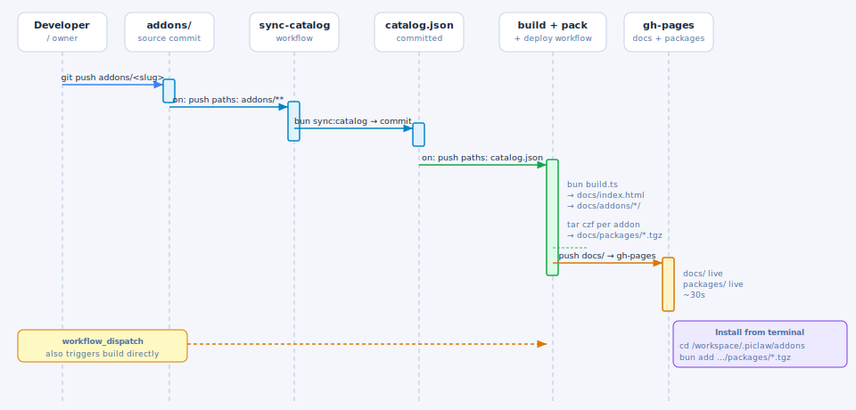

# piclaw-addons

Community extensions and add-ons for [piclaw](https://github.com/rcarmo/piclaw). Browse the full catalog at **[rcarmo.github.io/piclaw-addons](https://rcarmo.github.io/piclaw-addons/)**.

> **For agents:** see [AGENTS.md](AGENTS.md) for how to add, modify, and test addons.

---

## Installing add-ons

> **Important:** first-party `piclaw-addons` installs must use **public GitHub-hosted tarball URLs**.
> Do **not** switch examples, catalog entries, or runtime code to npmjs.org package specs or authenticated GitHub Packages reads.
> Runtime install/remove must work with zero registry auth.

### Web UI (recommended)

Open **Settings → Add-Ons**, pick an add-on, click **Install**. Restart required.

### `pi install`

```bash
pi install https://rcarmo.github.io/piclaw-addons/packages/piclaw-addon-proxmox-0.1.5.tgz
```

### `bun add`

```bash
cd /workspace/.pi/extensions
bun add https://rcarmo.github.io/piclaw-addons/packages/piclaw-addon-proxmox-0.1.5.tgz
```

---

## Settings panes and config

Add-on settings panes are **browser modules** loaded from `pi.web.entries`.

Use this split:

- **browser pane (`web/index.ts`)**
  - register the pane with `globalThis.__piclawSettingsPaneRegistry` / `globalThis.__piclaw_web?.registerSettingsPane`
  - use `globalThis.__piclawPreactHtm` / `globalThis.__piclawPreact`
  - read/write non-secret config via `GET` / `POST /agent/addons/api/<addon>/config`
  - store secrets via `GET` / `POST /agent/keychain`
- **runtime entry (`index.ts` / `extension.ts`)**
  - register config handlers with `globalThis.__piclaw_registerAddonConfigApi(...)`
  - keep non-secret values in extension KV / runtime storage
  - keep tokens/passwords in the keychain

Do **not** build new settings panes on top of internal slash-command bridges. Piclaw keeps that path only as a compatibility fallback for older add-ons.

For add-ons with meaningful web UI, prefer committing at least one screenshot under `addons/<slug>/assets/` and referencing it from the add-on README.
For settings-pane screenshots, use the microVM as a clean fixture: prefer an overlayfs-based temporary add-on view, capture the target pane by itself, then restore `cheapskate` afterward so the microVM stays useful for testing.

See:
- [AGENTS.md](AGENTS.md)
- [docs/architecture.md](docs/architecture.md)
- [`addons/sample-addon/README.md`](addons/sample-addon/README.md)

---

## Available add-ons

| Add-on | Description |
|---|---|
| [`autoresearch`](addons/autoresearch/) | Autonomous experiment loop sub-agent |
| [`cheapskate`](addons/cheapskate/) | Free-tier provider auto-rotation (`cheapskate/auto` model) |
| [`code-validator`](addons/code-validator/) | Code validation for Python, JS/TS, JSON |
| [`delegate`](addons/delegate/) | Task delegation to cheaper/faster models |
| [`dev-tools`](addons/dev-tools/) | Workspace diagnostics and environment tools |
| [`drawio-editor`](addons/drawio-editor/) | Self-hosted draw.io diagram editor |
| [`editable-table`](addons/editable-table/) | Spreadsheet-style Markdown table editor for the web UI |
| [`eml-viewer`](addons/eml-viewer/) | Email (.eml) viewer for the web timeline |
| [`imap`](addons/imap/) | IMAP email management with drafts and STARTTLS |
| [`kanban-board-widget`](addons/kanban-board-widget/) | Kanban board dashboard widget |
| [`portainer`](addons/portainer/) | Portainer container management |
| [`proxmox`](addons/proxmox/) | Proxmox VE infrastructure management |
| [`vent`](addons/vent/) | Adapted repackaging of pi-vent with a configurable output file |
| [`voice-pipeline`](addons/voice-pipeline/) | ESPHome voice assistant for ThinkSmart/ESP32 |
| [`yolochat`](addons/yolochat/) | Zero-guardrail inter-instance messaging |

---

## Publishing workflow



A push to any `addons/<slug>/` path triggers the full chain:

1. **sync-catalog** — regenerates `catalog.json` with **public tarball URLs** from addon `package.json` files
2. **build + deploy** — rebuilds the docs site and deploys the downloadable `.tgz` files to GitHub Pages
3. **publish** — optionally mirrors version-bumped packages to GitHub Packages for archival/alternate consumption

The supported first-party runtime install path is the **GitHub Pages tarball URL**, not npm registry resolution.

---

## Contributing

See [AGENTS.md](AGENTS.md) for how to add a new addon, run the metadata checks, and test locally.
