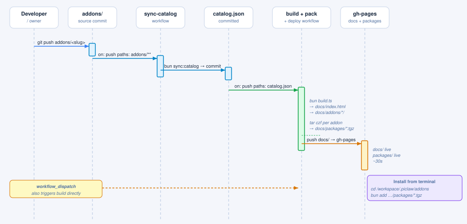

# piclaw-addons

Community extensions and add-ons for [piclaw](https://github.com/rcarmo/piclaw). Browse the full catalog at **[rcarmo.github.io/piclaw-addons](https://rcarmo.github.io/piclaw-addons/)**.

> **For agents:** see [AGENTS.md](AGENTS.md) for how to add, modify, and test addons.

---

## Installing add-ons

> **Important:** first-party `piclaw-addons` installs must use **public GitHub-hosted tarball URLs**.
> Do **not** switch examples, catalog entries, or runtime code to npmjs.org package specs or authenticated GitHub Packages reads.
> Runtime install/remove must work with zero registry auth.

### Web UI (recommended)

Open **Settings → Add-Ons**, pick an add-on, and click **Install**. Reload Piclaw to activate newly installed runtime or web entries.

### `pi install`

```bash
pi install https://rcarmo.github.io/piclaw-addons/packages/piclaw-addon-proxmox-0.1.8.tgz
```

### `bun add`

```bash
cd /workspace/.pi/extensions
bun add https://rcarmo.github.io/piclaw-addons/packages/piclaw-addon-proxmox-0.1.8.tgz
```

---

## Settings panes and config

Add-on settings panes are **browser modules** loaded from `pi.web.entries`.

Use this split:

- **browser pane (`web/index.ts`)**
  - register the pane with `globalThis.__piclawSettingsPaneRegistry` / `globalThis.__piclaw_web?.registerSettingsPane`
  - use `globalThis.__piclawPreactHtm` / `globalThis.__piclawPreact`
  - read/write non-secret config via `GET` / `POST /agent/addons/api/<addon>/<action>`; `config` is the common settings action
  - store secrets via `GET` / `POST /agent/keychain`
- **runtime entry (`index.ts` / `extension.ts`)**
  - register config handlers with `globalThis.__piclaw_registerAddonConfigApi(...)`
  - keep non-secret values in extension KV / runtime storage
  - keep tokens/passwords in the keychain

Do **not** build new settings panes on top of internal slash-command bridges. Piclaw keeps that path only as a compatibility fallback for older add-ons.

For add-ons with meaningful web UI, prefer committing at least one screenshot under `addons/<slug>/assets/` and referencing it from the add-on README.
For settings-pane screenshots, use the microVM as a clean fixture: prefer an overlayfs-based temporary add-on view, capture the target pane by itself, then restore `cheapskate` afterward so the microVM stays useful for testing.

See:
- [AGENTS.md](AGENTS.md)
- [docs/architecture.md](docs/architecture.md)
- [`addons/sample-addon/README.md`](addons/sample-addon/README.md)

---

## Available add-ons

| Add-on | Description |
|---|---|
| [`ast-grep-tool`](addons/ast-grep-tool/) | Structural code search and rewrite using ast-grep as a native LLM tool |
| [`autoresearch`](addons/autoresearch/) | Autonomous experiment loop sub-agent (start/stop/status tools via tmux) |
| [`cheapskate`](addons/cheapskate/) | Free-tier provider auto-rotation — select cheapskate/auto as your model and it transparently routes across configured free-tier backends (Gemini, Cerebras, Groq, SambaNova, OpenRouter, OpenCode Zen, NVIDIA, Cloudflare) |
| [`code-validator`](addons/code-validator/) | Diagnostics tool for code validation (Python, JS/TS, JSON, extensible via validators.json) |
| [`codex-conversion`](addons/codex-conversion/) | Codex-style prompt and tool adapter for OpenAI/Codex-like models in Piclaw |
| [`delegate`](addons/delegate/) | Delegate tasks to verified cheaper/faster child-Pi models with deterministic tier-safe selection |
| [`dev-tools`](addons/dev-tools/) | Developer tools for workspace diagnostics and environment inspection |
| [`diagram-tools`](addons/diagram-tools/) | Architecture diagram workflow — JSON graph definitions, SVG renderer, colour picker widget |
| [`drawio-editor`](addons/drawio-editor/) | Self-hosted draw.io diagram editor with workspace file integration |
| [`editable-table`](addons/editable-table/) | Editable Markdown table widget for the web UI — opens a themed spreadsheet-style grid and inserts the edited Markdown table back into chat |
| [`eml-viewer`](addons/eml-viewer/) | Attachment preview route for email message (.eml) files in the web timeline |
| [`export-timeline-pdf`](addons/export-timeline-pdf/) | Export chat timelines to PDF with inline avatars and referenced message pills |
| [`ghostty-terminal`](addons/ghostty-terminal/) | Modern, more functional Ghostty-web terminal pane renderer for high-end Piclaw browsers |
| [`git-query-tools`](addons/git-query-tools/) | Git history and JSON query tools for piclaw agents |
| [`goal`](addons/goal/) | Codex-style persisted thread goals with a hardened autonomous continuation loop and visible completion/stop summaries |
| [`image-processing`](addons/image-processing/) | Image manipulation tool (image_process) for Piclaw — resize, crop, convert, composite and more via sharp |
| [`imap`](addons/imap/) | IMAP email management tool — search/fetch, move/copy, flag, create drafts, file messages, and STARTTLS support |
| [`kanban-board-widget`](addons/kanban-board-widget/) | File-backed kanban board page and move API for workspace work items |
| [`kanban-editor`](addons/kanban-editor/) | Workspace .kanban.md editor add-on with Obsidian-style [[links]] between boards |
| [`late-night-regrets`](addons/late-night-regrets/) | Bayesian interaction-quality classifier scripts and optional scheduled reflection skill |
| [`lite-term`](addons/lite-term/) | xterm.js terminal pane identical to Piclaw's bundled default terminal and a good starting point for terminal customizations |
| [`mindmap`](addons/mindmap/) | D3-based mindmap editor pane for .mindmap.yaml files in Piclaw |
| [`observability`](addons/observability/) | OpenTelemetry observability — trace errors and agent turns across piclaw instances to Azure Application Insights (with Live Metrics) and local Graphite |
| [`office-tools`](addons/office-tools/) | Office document read/write tools for Piclaw (DOCX, XLSX, PPTX, and Markdown-to-PDF) |
| [`office-viewer`](addons/office-viewer/) | Office document viewer (.docx, .xlsx, .pptx, .odt, .ods, .odp) for Piclaw |
| [`plan-sidebar`](addons/plan-sidebar/) | Right-side session plan sidebar with canonical plan action=update and Markdown storage |
| [`portainer`](addons/portainer/) | Portainer management tool — session-scoped API config, ad-hoc requests, and orchestration workflows for endpoints, stacks, containers, images, networks, and volumes |
| [`proxmox`](addons/proxmox/) | Proxmox VE management tool — session-scoped API config, ad-hoc requests, and orchestration workflows for VMs, LXC containers, storage, tasks, and metrics |
| [`sample-addon`](addons/sample-addon/) | Sample add-on — starter template showing a settings pane, keychain secret, SQLite KV config, and a test endpoint |
| [`session-dashboard`](addons/session-dashboard/) | Roll-down active session dashboard with recent work summaries and context indicators |
| [`session-tree`](addons/session-tree/) | Interactive session tree timeline widget for Piclaw's /tree command |
| [`settings-dialog-screenshot`](addons/settings-dialog-screenshot/) | Developer skill for capturing tightly cropped screenshots of the Pi web settings dialog only |
| [`skill-model-effort`](addons/skill-model-effort/) | Honor model, effort, and thinking frontmatter on Piclaw skills |
| [`smart-compaction`](addons/smart-compaction/) | Standalone Pi-compatible smart compaction extension for vanilla pi users; Piclaw already includes this behavior natively. |
| [`stealth-browser`](addons/stealth-browser/) | Stealth browser automation via mochi.js — human-like interactions, fingerprint consistency, anti-detection bypass |
| [`telegram`](addons/telegram/) | Telegram Bot channel for PiClaw. Connects via Bot API long polling, receives/sends messages, and routes them through the agent. |
| [`vent`](addons/vent/) | Workspace vent log add-on, adapted from pi-vent by Igor Warzocha, with a configurable output file |
| [`voice-pipeline`](addons/voice-pipeline/) | ESPHome-only voice assistant pipeline for ThinkSmart/ESP32-Audio devices using Azure STT/TTS and the active Piclaw chat runtime |
| [`web-viewer`](addons/web-viewer/) | HTML, image, and video viewer panes and routes for Piclaw |
| [`whatsapp`](addons/whatsapp/) | WhatsApp channel source for Piclaw; the current package is not self-contained for standalone catalog use |
| [`win-ui`](addons/win-ui/) | Windows desktop automation tools via Win32 UI Automation and screenshots |
| [`writer-fonts`](addons/writer-fonts/) | Switch the document editor font from a dropdown in the editor footer — bundles Literata, Inter, Noto Sans, Noto Sans TC, New Tegomin and IBM Plex Sans, plus Georgia and the shipped System stack |
| [`yolo-vibe`](addons/yolo-vibe/) | Compose-box YOLO buttons (Continue, Audit, Docs) mounted in the bottom action bar, subtle until hover |
| [`yolochat`](addons/yolochat/) | Zero-guardrail inter-instance messaging — lets Pi instances post and reply to each other over HTTP |

---

## Publishing workflow



A merged pull request can trigger separate workflows on `main`:

1. **validate-metadata** — checks catalog metadata and the Earendil compatibility surface on pull requests and `main`
2. **sync-catalog** — regenerates `catalog.json` and root `package.json` metadata after add-on or catalog-script changes
3. **build + deploy** — rebuilds the site and public `.tgz` files after add-on, catalog, asset, or build changes
4. **publish** — mirrors version-bumped add-ons to GitHub Packages for archival or alternate consumption

The supported first-party runtime install path is the **GitHub Pages tarball URL**, not npm registry resolution.

---

## Contributing

See [AGENTS.md](AGENTS.md) for how to add a new addon, run the metadata checks, and test locally.
