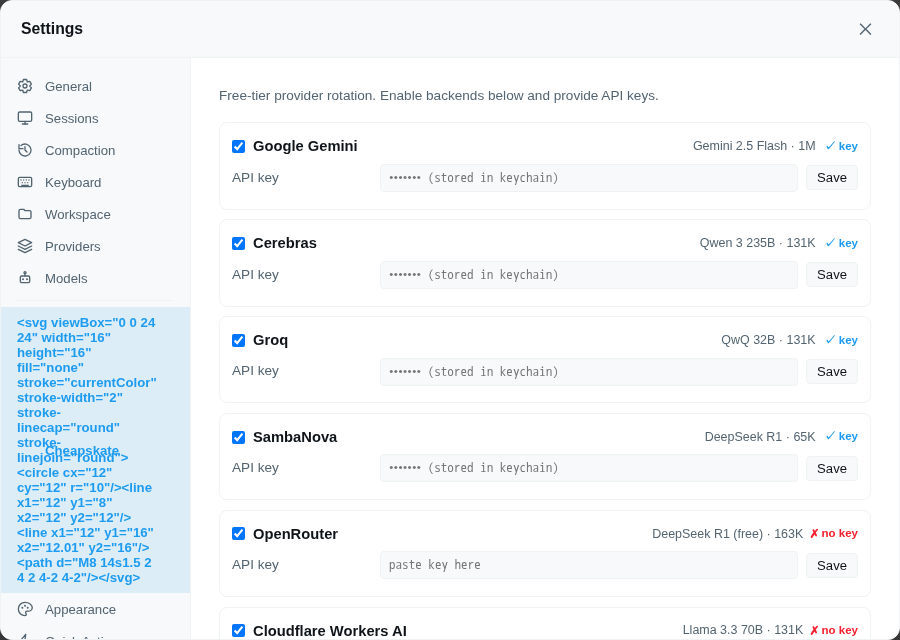

# Cheapskate

Free-tier provider auto-rotation for piclaw. Select `cheapskate/auto` as your model and requests are transparently routed to whichever free-tier backend is available, rotating on rate-limit errors.

## Install

Open **Settings → Add-Ons** and install **cheapskate** from the catalog.

## How it works

The addon registers a `cheapskate` provider with an `auto` model. When selected, it tries each enabled backend in order, skipping any that are rate-limited or have exhausted their free quota. If one backend fails, it rotates to the next.

Context-length errors also trigger rotation, so long conversations don't get stuck on a backend with a small context window.

## Backends

| Provider | Model | Context | Reasoning | Keychain entry |
|---|---|---|---|---|
| Google Gemini | Gemini 2.5 Flash | 1M | ✅ | `google/generative-ai-api-key` |
| Cerebras | Qwen 3 235B | 131K | ✅ | `cerebras/api-key` |
| Groq | QwQ 32B | 131K | ✅ | `groq/api-key` |
| SambaNova | DeepSeek R1 | 65K | ✅ | `sambanova/api-key` |
| OpenRouter | DeepSeek R1 (free) | 163K | ✅ | `openrouter/api-key` |
| Cloudflare Workers AI | Llama 3.3 70B | 131K | ❌ | `cloudflare/api-token` |

## Settings pane

Open **Settings → Cheapskate** to:

- Enable or disable individual backends
- Enter API keys directly — saved to the piclaw keychain
- Toggle safety caps on soft-cap providers (Cloudflare charges past the free tier)
- See at a glance which backends have keys configured

The pane reads/writes non-secret config through the direct backend add-on config API (`/agent/addons/api/cheapskate/config`) and uses `/agent/keychain` for secrets.

A restart is needed after adding or changing a key for the runtime to pick it up.

## Storage model

| What | Where |
|---|---|
| API keys | **Keychain** — each backend has a named entry (see table above). Keys are auto-injected as environment variables at runtime. |
| Backend enabled/disabled | **Runtime database** — extension KV store (SQLite, global scope, extension ID `cheapskate`) |
| Safety cap toggles | **Runtime database** — same KV store as above |

No config files are written to disk. Legacy `.pi/cheapskate.json` is auto-migrated to the runtime database on first load.
