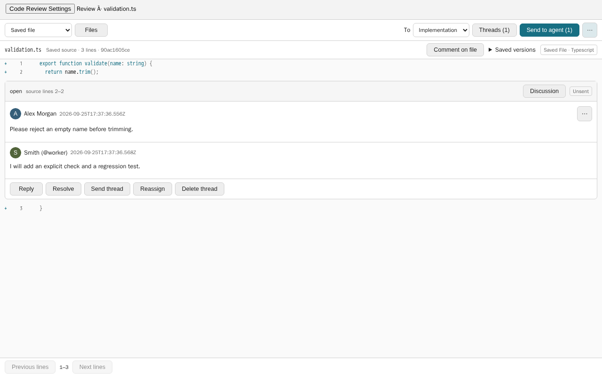

# Code Review

Review saved source and Git diffs in Classic, keep inline discussions and private
drafts, and send new or updated discussions to a local agent. Source is read-only;
posting a comment does not start agent work.



*Classic pane, rendered from the real add-on with disposable sample source and
profiles. The screenshot uses no live review data.*

## Review and send

- Choose **Review file** from the workspace explorer. Git is optional; unchanged
  saved files are supported alongside staged, unstaged and commit comparisons.
- Messages and thread summaries show the configured operator/agent name and
  avatar. Agent handles are resolved by the stored author's identity, not the
  thread's current assignment. Missing profiles/images fall back to labels/initials.
- Post comments and replies normally. **Send to agent** automatically discovers
  open, new or updated discussions for the chosen agent; there are no inclusion
  checkboxes. Review the preview and confirm to queue a batch of up to 50 threads.
  Additional discussions can be sent in a later batch. Private drafts are excluded.
- **Unsent** includes changed guidance since the last send. Discussions with
  queued/running or uncertain work wait for that work to finish or be reconciled.
  Other targets are not silently reassigned.
- Resolve your own discussion with one click, or reopen it without sending work.
  Agent resolutions still require an explanation and valid source mapping.
- Delivery status stays beside the discussion: **Queued**, **Failed**, or
  **Delivery uncertain**. There is no receipts pane. Uncertain sends have an
  explicit **Check delivery** action; they are never replayed automatically.

## Manage saved reviews

Open **Settings → Add-ons → Code Review** for the Reviews list. **Open** uses the
stored review ID and snapshots, so it works after the source file is renamed or
deleted. Closing a review tab only closes its pane.

**Delete** permanently removes that review's messages, revisions, private drafts,
snapshots and stored source bytes from the active add-on database. Source files are
never deleted. Confirmation is required; an in-flight send must finish first.
Already accepted work cannot be recalled, but subsequent review-tool reads/writes
fail once the review is deleted. Minimal body-free request tombstones prevent
old requests from recreating it. Backups and already-delivered instructions are
not erased; this is logical deletion, not a forensic purge of SQLite pages.

**Automatically delete reviews older than N days** is off by default. Enable it
with confirmation and a whole number from 1 to 3650 days. Age means time since
last review activity, including recent drafts. The add-on checks hourly after a
verified workspace context has been seen, and when Settings refreshes, deleting
up to 100 old reviews per pass. The saved policy survives restart. Queued, running
and uncertain work is skipped; inactive unsent discussions can expire under this
policy. Reviews in another workspace are never selected by the cleanup pass.

The active release checklist is six Classic-only checks in
`specs/code-review/ACCEPTANCE.md`. The 184 older Gherkin IDs remain archived
design reference, not individual release gates. Run `bun addons/code-review/coverage.ts`
from the repository root for the compact checklist (`--legacy` includes the old
inventory). No checklist row passes merely because a test mentions its ID.
The agreed mockup's Classic layout, controls and interactions are still required;
the simplified checklist does not authorise UX deviations.

## Required host API

**Requires Piclaw 3.2.3 or later, using Classic.** Version 3.2.3 is the first tagged
release containing the required add-on APIs from PR #1407. Version 3.2.2 does not
contain them. Visual is not supported for this release.

The pane feature-detects `__piclaw_web.workspaceActionsVersion === 1`; the backend
requires `__piclaw_runtime.localContext.version === 1` and host-verified submission
references. Its route is `piclaw://addon/code-review/<id>`. The package declares
`compatibleVersions: ">=3.2.3"`; the packed add-on is tested against the tagged
3.2.3 source in a disposable authenticated host.

The host supplies trusted operator or explicit review-dispatch agent identity.
Ordinary legacy prompts, side/scheduled tasks and remote-origin turns do not gain
review authority from an ambient chat ID. Code Review requires the host-verified
`reference: {addonId, intentId}` for the current submission. Each Send may include
many concerns/files; another Send has separate review-tool scope even in the same
review/chat. The host implementation and evidence are documented in
`specs/code-review/CR-079-HOST-CONTRACT.md`. If agent context is unavailable, use
**Send to agent** from an authorised review. Direct API fields never establish
ownership. Browser actions are authenticated; there are no external peer routes.

## Storage

`messaging.getAddonDataDir('code-review')/reviews.db` belongs to this add-on. Do not
point it at Piclaw's core message database. Snapshots and review records are
versioned; uninstall must retain the directory. Back up the SQLite database
consistently, including any WAL state. Destructive reset is not an implicit upgrade.

## Testing during development

From the repository root, retain the checked-in test preloads:

```sh
bun test addons/code-review
./node_modules/.bin/tsc --noEmit -p addons/code-review/tsconfig.json
```

The browser integration test creates its own ephemeral loopback server, database,
workspace, profile and fake queue adapter. `PICLAW_REVIEW_TEST_BROWSER` may name an
existing Chromium executable; it never names a target server. No paid provider or
live Piclaw instance is used. The opt-in `host.optional.test.ts` instead boots
a disposable Piclaw worktree with its own workspace, profile and SQLite store;
`PICLAW_REVIEW_AUTH_TEST=1` enables a fixture-only TOTP session, and
`PICLAW_REVIEW_AGENT_TEST=1` uses a deterministic local provider. Set
`PICLAW_REVIEW_PACKAGE_TARBALL` to a locally packed tarball to replace the
source-tree copy and install its production dependencies in that fixture.
It never installs or reloads the running instance. The acceptance ledger records
verified Classic flows and the platform/stress combinations not covered.

Agent `thread` reads compare the bounded current saved file against the original
anchor side. The `currentSource` status is observational and may be `unverified`
for Git/index/commit snapshots without a saved-file identity. It returns no
current source text or digest; use ordinary authorised source tools to inspect
changed code. The original anchor, saved bytes and history remain unchanged.

If a public reply commits but its response is lost, the pane stores only the
request, thread and optional draft identifiers in same-origin browser storage.
The pane offers explicit receipt reconciliation after reload or in another tab;
it never resends automatically. The server checks the current operator, actor,
review and thread before returning a body-free receipt. A missing receipt
retains the acknowledged draft. If the marker is unreadable, reply posting is
blocked until the operator confirms clearing that browser marker after checking
saved replies and drafts. The browser marker contains only identifiers and grants no authority; every
lookup requires a current authorised session. It is not automatically expired on
sign-out. Clear it explicitly from the pane after checking the saved reply.

Install dependencies for this package using `bun install` in its directory. Source
capture uses safe Git argv and bounded UTF-8 regular-file reads. Syntax parsing
uses packaged Lezer dependencies and returns escaped plain text on unsupported or
large input.

## Use and rollback

1. On Piclaw 3.2.3 or later in Classic, install **Code Review** from Add-ons.
2. Select a saved file in the workspace and choose **Review file**.
3. Post comments, then use **Send to agent** to preview new or updated discussions
   for that target. Confirming queues one submission across the included files.
4. To remove the add-on, use Add-ons → Uninstall, then restart when convenient.
   Its review database is retained. Reinstall the same version to reopen the work;
   do not delete or replace the store as part of rollback.

Installing/removing an add-on requires the normal host restart to load/unload it.
Do not reset the database or downgrade its schema. Back it up consistently before
upgrading the host or package.
