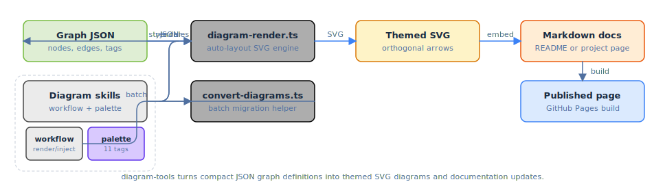

# diagram-tools

Architecture diagram workflow for the portfolio site — JSON graph definitions → SVG rendering → colour palette management.

## How it works



Define a graph in JSON (nodes, edges, semantic tags), render it to SVG with automatic left-to-right layout and orthogonal arrow routing, inject it into project markdown, and rebuild the site. An interactive colour picker widget lets you adjust the 11-tag palette visually.

## What's included

| Component | Description |
|---|---|
| **diagram-workflow** skill | End-to-end: define JSON → render SVG → inject into markdown → rebuild |
| **diagram-colour-picker** skill | Interactive widget for adjusting the colour palette |
| `diagram-render.ts` | Build-time SVG layout engine (importable module + CLI) |
| `convert-diagrams.ts` | Batch-convert hand-crafted SVG diagrams to JSON definitions |
| `colour-picker-widget.html` | Self-contained HTML widget with live swatch preview |

## Graph JSON spec

```json
{
  "title": "Caption text below the diagram",
  "nodes": [
    {
      "id": "unique-id",
      "label": "Display name",
      "sub": "Subtitle line",
      "tag": "web",
      "column": 0, "row": 0,
      "children": [
        { "id": "child-id", "label": "Child", "sub": "detail", "tag": "scripting" }
      ]
    }
  ],
  "edges": [
    { "from": "source-id", "to": "target-id", "label": "optional", "accent": true }
  ]
}
```

## Semantic tags

| Tag | Colour | Use for |
|---|---|---|
| `web` | blue | frontends, browsers, UIs |
| `backend` | blue | servers, APIs, runtimes |
| `state` | grey | databases, stores, config |
| `artifacts` | amber | builds, files, models |
| `processing` | dark grey | engines, pipelines, transforms |
| `scripting` | light grey | scripting, plugins, extensions |
| `infra` | blue | containers, VMs, infrastructure |
| `external` | green | external services, APIs |
| `input` | green | user input, sources, triggers |
| `output` | orange | results, exports, destinations |
| `monitor` | purple | monitoring, logging, observability |

## Layout features

- **Left-to-right columns** with automatic spacing based on content width
- **Children/sub-steps** rendered as smaller boxes in a dashed group below the parent
- **Orthogonal arrow routing** with r=14 rounded corners
- **Arrows connect to inner parent rect**, not group bounding box
- **Dark/light theme** via `prefers-color-scheme` (light as default for rsvg-convert)
- **Edge labels** positioned on the horizontal segment, just above the line

## Quick start

```bash
# Render a single diagram
bun scripts/diagram-render.ts _diagrams/my-project.json _diagrams/my-project.svg

# Batch-convert existing hand-crafted SVGs to JSON
bun scripts/convert-diagrams.ts

# Regenerate all after palette change
for f in _diagrams/*.json; do
  bun scripts/diagram-render.ts "$f" "_diagrams/$(basename $f .json).svg"
done
```
