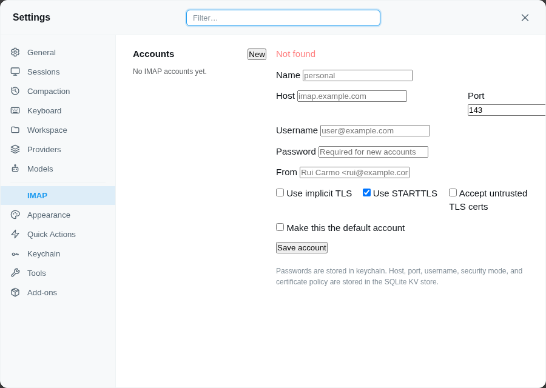

# piclaw-addon-imap

## Install

Open **Settings → Add-Ons** and install **imap** from the catalog.

IMAP email management addon for piclaw.

Includes a web settings pane for managing accounts.



## Features

- list folders
- search messages
- fetch envelopes or full message source
- move/copy messages
- add/remove IMAP flags
- create drafts via IMAP `APPEND`
- file composed messages into arbitrary folders
- create/delete folders
- implicit TLS (`993`) or STARTTLS (`143`)
- SQLite KV account settings + keychain-backed passwords
- web settings pane for add/edit/delete/default account management

## What it is for

Use this addon when you want Pi to:

- inspect mailboxes over IMAP
- search and fetch messages
- file information into folders
- create drafts without SMTP
- manage multiple IMAP accounts from one settings pane

It is **not** an SMTP sender or a full mail client.

## Storage model

### SQLite KV store
Non-secret account settings are stored in the extension SQLite KV store:

- account name
- host
- port
- user
- from
- `tls`
- `starttls`
- `allowInsecureTls`
- default account

### Keychain
Passwords are stored in keychain only:

- `imap/<name>/password`

## Settings pane

The settings pane supports:

- list accounts
- create account
- edit account
- delete account
- set default account
- toggle implicit TLS
- toggle STARTTLS
- toggle acceptance of untrusted/private/self-signed/expired certs

### Per-account fields

- `name`
- `host`
- `port`
- `user`
- `password`
- `from`
- `tls`
- `starttls`
- `allowInsecureTls`

## Security modes

### Implicit TLS
Use:

- `tls: true`
- usually port `993`

### STARTTLS
Use:

- `tls: false`
- `starttls: true`
- usually port `143`

### Plain IMAP
Use:

- `tls: false`
- `starttls: false`

Only sensible on a trusted LAN.

## Accept untrusted certificates

`allowInsecureTls: true` disables certificate verification for that account.

This covers:

- private CA certificates
- self-signed certificates
- expired certificates
- hostname mismatch
- broken chains

Use it only when necessary.

## Account management through the tool

In addition to the settings pane, the `imap` tool supports:

- `list_accounts`
- `get_account`
- `save_account`
- `delete_account`
- `set_default_account`

### Example: save account

```json
{
  "action": "save_account",
  "account": "local",
  "host": "192.168.1.250",
  "port": 143,
  "user": "rcarmo",
  "pass": "...",
  "tls": "false",
  "starttls": "true",
  "allowInsecureTls": "true",
  "setDefault": "true"
}
```

## Mailbox actions

The same tool also supports:

- `list_folders`
- `search`
- `fetch`
- `move`
- `copy`
- `flag`
- `create_draft`
- `file_message`
- `create_folder`
- `delete_folder`

## Examples

### List accounts

```json
{
  "action": "list_accounts"
}
```

### Search unread mail

```json
{
  "action": "search",
  "account": "local",
  "folder": "INBOX",
  "seen": "false",
  "limit": 20
}
```

### Fetch full source

```json
{
  "action": "fetch",
  "account": "local",
  "folder": "INBOX",
  "uids": "12345",
  "withBody": "true"
}
```

### Create draft

```json
{
  "action": "create_draft",
  "account": "local",
  "draftTo": "someone@example.com",
  "draftSubject": "Test draft",
  "draftBody": "Hello from Pi"
}
```

## Operational note for the local Synology-style server

In your current local setup:

- IMAPS on `993` was closed
- IMAP on `143` worked
- STARTTLS worked
- strict verification failed because the certificate was expired

So the working temporary config was:

```json
{
  "host": "192.168.1.250",
  "port": 143,
  "user": "rcarmo",
  "tls": false,
  "starttls": true,
  "allowInsecureTls": true,
  "from": "rcarmo"
}
```

Once the certificate is renewed, `allowInsecureTls` should be set back to `false`.

## Notes

- No SMTP support.
- This addon cannot send mail; it only manipulates mailboxes over IMAP.
- Drafts and filed messages are created with IMAP `APPEND`.
- Mutating actions support `dryRun` where appropriate.
- `delete_folder` requires `confirm=true`.
