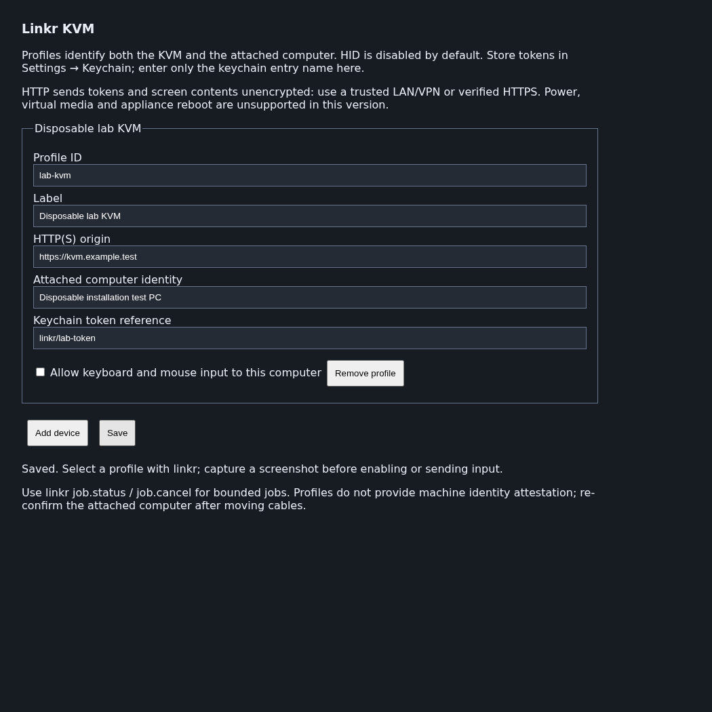

# Linkr KVM

Control a computer connected to a Radxa Linkr through Piclaw: capture its screen, send keyboard and mouse input, and run short firmware-entry sequences. The `linkr` tool handles input and timing; seven bundled skills guide screen-dependent BIOS, boot and operating-system installation work.

Requires Piclaw **3.1.2 or later**, a reachable Linkr and a public API token. The add-on uses the documented snapshot and HID interfaces. It does not implement power control, virtual media or appliance reboot.

## Install

Install **Linkr** from Settings → Add-ons using the [public catalogue](https://rcarmo.github.io/piclaw-addons/), or use the [v0.1.0 tarball](https://rcarmo.github.io/piclaw-addons/packages/piclaw-addon-linkr-0.1.0.tgz). Package name: `@rcarmo/piclaw-addon-linkr`.

Reload Piclaw after installation to load the tool, Settings pane and skills. Installing the package sends no requests to a device.

## Configure a device

1. Create an access token in the Linkr web interface under System Settings → Access Token.
2. Store it in Piclaw's keychain. Do not paste it into a chat, profile field or command argument.
3. Open Settings → Linkr and add a profile:

   | Field | Value |
   |---|---|
   | Profile ID | A unique identifier, such as `lab-kvm` |
   | Label | A recognisable device name |
   | HTTP(S) origin | The Linkr origin, such as `https://kvm.example.test` |
   | Attached computer identity | The computer connected to the KVM |
   | Keychain token reference | The entry name, such as `linkr/lab-token`; never the token itself |
   | Allow keyboard and mouse input | Leave disabled until the screen and target have been verified |

4. Save the profile, check a screenshot, then enable input if needed.

Profiles support up to 32 devices. IDs and origins must be unique. Origins cannot contain embedded credentials, paths or query strings. Use an explicit `device_id` in calls, or select a profile for the current chat with `profile.select`. Moving a cable requires checking the attached-machine identity again.

The documented API uses plain HTTP. Use it only on a trusted LAN/VPN, or through a verified HTTPS endpoint. The client validates TLS certificates and refuses redirects. Requests send the referenced token to the configured origin; confirm that destination before saving.



This screenshot comes from a loopback-only browser fixture with a mocked config API. It contains no real device or credentials.

## Capture and send input

These JSON objects are arguments to the `linkr` tool.

Capture the selected computer:

```json
{"action":"snapshot","device_id":"lab-kvm"}
```

The response contains a JPEG and capture metadata. A new HTTP capture does not establish that the source frame is current, that a display signal is present or that the computer is powered on. `status` checks snapshot retrieval and reports power state as unknown.

Preview a key combination:

```json
{"action":"key.combo","device_id":"lab-kvm","keys":["ControlLeft","KeyL"]}
```

After confirming the active application and intended action, send it:

```json
{"action":"key.combo","device_id":"lab-kvm","keys":["ControlLeft","KeyL"],"execute":true}
```

Input commands validate locally by default. Sending requires both `execute:true` and input enabled in the profile. The flag records execution intent; it is not a human-approval mechanism. Capture and inspect the screen after acting. Acknowledgement from the KVM does not prove the intended application result.

| Actions | Purpose |
|---|---|
| `help`, `capabilities` | List actions, limits and unsupported interfaces |
| `profile.list`, `profile.select` | Inspect configuration or select a chat's device |
| `status`, `snapshot` | Check snapshot retrieval or return an image |
| `key.tap`, `key.combo`, `key.repeat` | Paired key input with bounded repetition |
| `text` | ASCII text in 30-character chunks with pauses |
| `mouse.move`, `mouse.click`, `mouse.drag`, `mouse.scroll` | Absolute movement/click/drag and relative scrolling |
| `input.batch`, `input.release` | Validated event batches; release uncertain input tracked for the same chat |
| `job.start`, `job.status`, `job.cancel` | Bounded capture and firmware-entry jobs |
| `reboot.plan`, `firmware.entry.plan` | Plan a reboot method or validate a firmware-entry job; neither reboots a device |

See the [tool contract](docs/tool-contract.md) for parameters and examples. Text accepts printable ASCII, tab and newline only; newline may submit a form or execute a command. Confirm keyboard layout and focus before typing. Use SSH or browser automation when they provide a more reliable interface.

## Enter BIOS or a boot menu

Firmware entry needs a machine-specific key and timing window. Obtain the key from a visible prompt, vendor documentation or an operator-confirmed procedure. Do not assume F2, Delete or F12 works on an unidentified machine.

`reboot.plan` lists possible methods. An operator, an observed OS interface or a separately authorised platform tool must perform the actual reboot. The add-on has no automatic reboot integration or Ctrl+Alt+Delete fallback.

Preview a firmware-entry job:

```json
{
  "action": "firmware.entry.plan",
  "device_id": "lab-kvm",
  "job": {
    "kind": "firmware-entry",
    "duration_ms": 15000,
    "capture_interval_ms": 1000,
    "key": "F2",
    "key_evidence": "Operator-confirmed key for this machine",
    "tap_start_ms": 500,
    "tap_interval_ms": 250,
    "tap_duration_ms": 3000
  }
}
```

To start, change `action` to `job.start` and add `execute:true`. **Timings begin at local job start**, not at a detected reboot or loss of video. Coordinate the reboot before executing. The example values require qualification on the selected computer.

The job schedules taps locally, so it does not wait for a model turn between keys. The tap window ends after its configured duration, and captures continue until the job deadline. There is no BIOS detector: the agent must inspect the frames. Keep bursts short because a key can have a different effect once firmware opens. Network delay can still make delivery uncertain.

Inspect or cancel using the returned ID:

```json
{"action":"job.status","job_id":"RETURNED_JOB_ID"}
```

Add `frame_index:0` to retrieve the first captured image. `job.cancel` stops future work but may return before the job settles. Check its status again. Cancellation cannot undo input already delivered.

### BIOS, boot order and installation skills

| Skill | Guidance |
|---|---|
| `linkr-control` | Select a target, observe, act and verify |
| `linkr-reboot-bios` | Choose a reboot method, qualify entry timing and recover a missed window |
| `linkr-firmware-navigation` | Read navigation legends, traverse menus and record original values |
| `linkr-boot-selection` | Distinguish a one-time boot override from a persistent order change |
| `linkr-os-install` | Establish media/disk requirements, inspect installer choices and verify the installed system |
| `linkr-recovery` | Diagnose blank screens, boot loops and uncertain input |
| `linkr-qualify-device` | Record device-specific capability and timing evidence |

These skills require screen interpretation and operator decisions. They provide no universal BIOS macro or unattended installation engine. For temporary booting, prefer a one-time override. Before an installer writes a disk, identify the actual target and obtain approval of the displayed partition/erase summary. Never choose a disk by position alone, bypass a firmware password or change TPM/Secure Boot settings merely to make installation proceed.

## Limits and recovery

- Jobs last **1–60 seconds**, with captures at intervals of **1–10 seconds**. Firmware tap windows are at most **5 seconds**.
- At most four jobs run at once, with one job per configured origin. Control leases prevent overlapping HID operations for an origin within one Piclaw process. Other processes, hostname aliases and physical input can still interfere.
- Input batches have at most 256 events, 60 seconds of requested delays and 1,024 text characters. Keys and buttons must end released.
- Transport failures are not retried automatically. Input may have reached the device even when acknowledgement fails. Observe first; `input.release` can reconcile uncertain tracked input owned by the same chat.
- Jobs continue after their start call returns, but do not resume after Piclaw restarts. In-memory job lookup and control state are lost on restart; inspect the target before further input.
- Forced power changes during firmware updates, installation, encryption or storage repair can damage the system. Do not infer failure from a blank screen or slow progress alone.

Read [safety and scope](docs/safety-and-scope.md) before BIOS changes or installation.

## Credentials and captured evidence

Profiles store keychain references, not credential values. The client resolves the token server-side and sends it in the authentication header. Tool responses suppress remote error text and do not echo typed text, but text supplied as tool arguments can still appear in conversation history. Use operator entry for passwords and recovery keys when a suitably private input path is unavailable.

Jobs automatically save `job.json` and JPEG frames under `.piclaw/data/addons/linkr/jobs/<job-id>/` in the workspace. Directories are created with mode `0700`; files with `0600`. Each job is capped at 32 MiB of image data. Pruning runs when another job starts, removing inactive job directories older than 24 hours or outside the newest 20. This is not a scheduled deletion guarantee, and active jobs are retained.

Screenshots may contain sensitive information displayed on the attached computer. Review images and job metadata before sharing them. No user captures, device credentials or configured profiles are included in the public package.

## Unsupported interfaces

`power.status`, `power.press`, `power.reset`, `power.cycle`, `media.list`, `media.mount`, `media.eject` and `device.reboot` return `unsupported` without sending device requests. Supply installation media through the operator or a separately authorised management tool.

The [firmware 1.4.2 evidence note](docs/firmware-api-evidence.md) records candidate UI-side media, appliance-reboot and Wake-on-LAN interfaces. Those use session authentication; they are not stable public contracts or evidence that the public token works with them. No ATX control was found in the inspected UI. Appliance reboot, target reboot and Wake-on-LAN are distinct operations.

## Tests and qualification

At the v0.1.0 merge ([validation run](https://github.com/rcarmo/piclaw-addons/actions/runs/34716571245)):

- 15 isolated Linkr tests passed, with 76 assertions.
- The combined compatibility suite passed 140 tests; standalone-import checks passed 28.
- TypeScript, catalogue validation and package checks passed.
- A mocked Playwright Settings fixture passed rendering, editing, save confirmation and disabled-HID defaults, with no device traffic.

The earlier standalone screenshot helper was tested on a real Linkr. Packaged add-on HID, firmware timing, installation workflows and full host UI integration have not been live-qualified. The passing repository UX workflow does not establish Linkr-specific end-to-end coverage. Follow [qualification and testing](docs/qualification-and-testing.md) before using it on hardware.

From the repository root:

```sh
bun install --frozen-lockfile
bun test addons/linkr
bun run typecheck:earendil-compat
bun run check:catalog
bun test standalone-import.test.ts
```

For contributors with a local host-development environment: to reproduce the mocked Settings screenshot, run `addons/linkr/scripts/settings-fixture.ts` with `LINKR_FIXTURE_PLAYWRIGHT` pointing to a Playwright `index.mjs`, `LINKR_FIXTURE_HOST_MODULES` to installed host `node_modules`, and `PLAYWRIGHT_BROWSERS_PATH` to the matching browser installation.

## References and licence

- [Official Link Skills guide](https://docs.radxa.com/en/linkr/linkr/advanced-usage/link-skills) — public snapshot/control API and token authentication.
- [Upstream skill](https://github.com/radxa-linkr/linkr-skills) — reviewed commit `2e3cb7fe025f364ac3cb017d2884c3b50e444240`.
- [Linkr documentation](https://docs.radxa.com/en/linkr/linkr/) — product documentation root linked by the guide.
- [Discovery portal](https://linkr.now/) — browser-tested; the add-on does not scan automatically.
- [Firmware releases](https://github.com/radxa-linkr/linkr/releases) — linked by the portal; individual releases were not audited.

MIT-licensed; see [LICENSE](LICENSE). Attribution for Radxa Linkr material is retained. This is an independent Piclaw integration.
