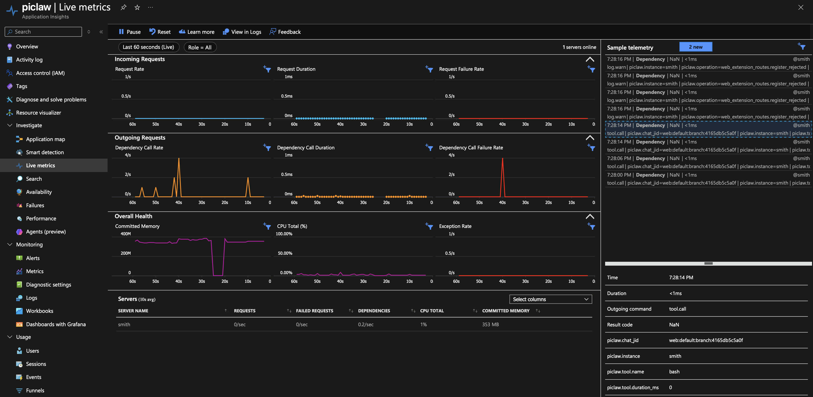

# piclaw-addon-observability

OpenTelemetry observability for piclaw — trace errors and agent turns across multiple instances to **Azure Application Insights** (with Live Metrics Stream) and **local Graphite**.



Uses the runtime's structured log-sink contract. The runtime never imports OTel — it just logs structured records. This addon subscribes to those records and creates OTel spans, exceptions, and Graphite metrics from them.

## Setup

### 1. Install

Open **Settings → Add-Ons** and install **observability** from the catalog.

### 2. Configure via Settings → Observability

The pane loads/saves non-secret settings through the direct backend add-on config API (`/agent/addons/api/observability/config` and `/agent/addons/api/observability/browser-config`). The connection string can be pasted directly into the settings pane — it is saved to the keychain automatically as `azure/appinsights-connection-string`. A restart is needed after setting or changing the connection string.

| Field | Type | Default | Description |
|---|---|---|---|
| **Enabled** | checkbox | off | Master switch |
| **Instance name** | text | `hostname()` | Identifies this instance in App Insights (`cloud_RoleInstance`). Set to e.g. `smith`, `relay`, `orangepi`. |
| **App Insights enabled** | checkbox | on | Sub-toggle for the Azure backend |
| **Connection string** | password | — | Paste the App Insights connection string directly. Saved to keychain as `azure/appinsights-connection-string`. |
| **Live Metrics Stream** | checkbox | on | Real-time telemetry in the Azure portal ([QuickPulse](https://learn.microsoft.com/en-us/azure/azure-monitor/app/live-stream)) |
| **Standard metrics** | checkbox | on | OTel standard metrics collection (CPU, memory, request rate) |
| **Sampling ratio** | number | 1 | 0–1. 1 = send all traces. 0.5 = sample 50%. |
| **Browser agent telemetry** | checkbox | on | Loads the App Insights browser SDK and translates agent SSE/follow-up activity into custom events keyed by chat JID. |
| **Graphite enabled** | checkbox | off | Sub-toggle for Carbon plaintext push |
| **Host** | text | — | Graphite/Carbon receiver host, e.g. `192.168.1.250` |
| **Port** | number | 2003 | Carbon plaintext port |
| **Metric prefix** | text | `piclaw` | Root prefix for all Graphite metric paths |

## Storage model

| What | Where |
|---|---|
| App Insights connection string | **Keychain** — entry `azure/appinsights-connection-string`. Entered directly in the settings pane. |
| All other settings | **Runtime database** — extension KV store (SQLite, global scope, extension ID `observability`) |
| Browser actor identity | **Derived at runtime** — the browser SDK maps App Insights actor identity to `chatJid` and preserves browser IDs as separate custom dimensions |

No config files are written to disk.

### 3. Deploy to other instances

Each piclaw instance needs:
- The addon installed
- The same keychain entry with the App Insights connection string
- `instance_name` set to a unique value in Settings → Observability

---

## Architecture

<svg viewBox="0 0 680 260" xmlns="http://www.w3.org/2000/svg" style="max-width:680px;width:100%;height:auto;font-family:system-ui,sans-serif;font-size:13px">
  <defs>
    <marker id="ah" markerWidth="8" markerHeight="6" refX="8" refY="3" orient="auto"><path d="M0,0 L8,3 L0,6" fill="#2563eb"/></marker>
  </defs>
  <!-- Instances -->
  <rect x="10" y="10" width="140" height="150" rx="8" fill="#f0f4ff" stroke="#2563eb" stroke-width="1.5"/>
  <text x="80" y="32" text-anchor="middle" font-weight="700" fill="#0f1c2e">Instances</text>
  <text x="80" y="54" text-anchor="middle" fill="#555" font-size="12">smith (LXC)</text>
  <text x="80" y="72" text-anchor="middle" fill="#555" font-size="12">relay (Docker)</text>
  <text x="80" y="90" text-anchor="middle" fill="#555" font-size="12">orangepi (host)</text>
  <text x="80" y="108" text-anchor="middle" fill="#555" font-size="12">sandbox (Docker)</text>
  <text x="80" y="126" text-anchor="middle" fill="#555" font-size="12">microvm (systemd)</text>
  <!-- App Insights -->
  <rect x="280" y="10" width="260" height="150" rx="8" fill="#eff6ff" stroke="#2563eb" stroke-width="1.5"/>
  <text x="410" y="32" text-anchor="middle" font-weight="700" fill="#1e3a5f">Azure Application Insights</text>
  <text x="410" y="56" text-anchor="middle" fill="#555" font-size="11">Failures blade — errors by instance</text>
  <text x="410" y="74" text-anchor="middle" fill="#555" font-size="11">Application Map — topology</text>
  <text x="410" y="92" text-anchor="middle" fill="#555" font-size="11">Transaction Search — per-turn traces</text>
  <text x="410" y="110" text-anchor="middle" fill="#555" font-size="11">Live Metrics — real-time stream</text>
  <!-- Arrow instances → App Insights -->
  <line x1="150" y1="85" x2="275" y2="85" stroke="#2563eb" stroke-width="2" marker-end="url(#ah)"/>
  <text x="212" y="78" text-anchor="middle" fill="#2563eb" font-size="10" font-weight="600">OTLP/HTTP</text>
  <!-- Graphite -->
  <rect x="280" y="190" width="200" height="50" rx="8" fill="#f0fdf4" stroke="#16a34a" stroke-width="1.5"/>
  <text x="380" y="220" text-anchor="middle" font-weight="600" fill="#166534">Graphite :2003</text>
  <!-- Arrow instances → Graphite -->
  <line x1="120" y1="160" x2="275" y2="215" stroke="#16a34a" stroke-width="1.5" stroke-dasharray="6 3" marker-end="url(#ah)"/>
  <text x="180" y="200" text-anchor="middle" fill="#16a34a" font-size="10" font-weight="600">Carbon plaintext</text>
</svg>

---

## How it works

The addon uses piclaw's **log-sink contract** — a generic API that any addon can use. Server-side spans are derived from runtime records, and the browser layer translates agent SSE/follow-up activity into App Insights `customEvents` keyed by `chatJid`.

Server side:

```
runtime                              addon
───────                              ─────
log.info("Prompting session", {
  operation: "run_agent.prompt",     ──►  sink receives record
  chatJid: "web:default",                 creates Span "agent.turn"
  model: "azure-openai/gpt-5-4",         stores in inflightTurns map
})

  ... model runs, tools fire ...

log.info("Tool execution ended", {
  operation: "tool.call.end",        ──►  sink receives record
  chatJid: "web:default",                 creates child Span "tool.call"
  toolName: "bash",                       pushes Graphite metric
  durationMs: 320,
})

log.info("Agent run completed", {
  operation: "run_agent.complete",   ──►  sink receives record
  chatJid: "web:default",                 finds inflight span
  durationMs: 4523,                       ends span → App Insights
})                                        pushes Graphite metrics
```

If the addon isn't installed, no sink is registered and there is zero overhead.

See the [runtime observability docs](https://github.com/rcarmo/piclaw/blob/main/docs/observability.md) for the full log-sink API and operation reference.

---

## Instance identity

| OTel Resource attribute | App Insights field | Value |
|---|---|---|
| `service.name` | `cloud_RoleName` | `piclaw` |
| `service.instance.id` | `cloud_RoleInstance` | config `instance_name` (or hostname) |
| `host.name` | — | always OS `hostname()` |
| `deployment.environment` | custom dimension | auto-detected: `docker` / `lxc` / `host-native` |
| `service.version` | — | piclaw package version |

---

## Agent identity mapping

| Concept | Mapping |
|---|---|
| Primary actor | `chatJid` |
| Primary transaction | `turnId` |
| Runtime session / fork identity | `sessionLeafId` when present |
| Browser correlation | `piclaw.browser_user_id`, `piclaw.browser_session_id`, `piclaw.browser_client_id` |
| App Insights user-style field | `enduser.id = chatJid` |

This makes App Insights charts and `customEvents` more useful for agent analytics: the actor is the chat/agent JID, not the anonymous browser user.

---

## Data sent

### Log operation → Span / Metric mapping

| Log operation | OTel Span | Graphite metric |
|---|---|---|
| `run_agent.prompt` → `run_agent.complete` | `agent.turn` (**request-style** span; paired by `turnId`, fallback `chatJid`) | `agent.turn.count`, `agent.turn.duration_ms`, `agent.turn.success` |
| `run_agent.prompt` → `run_agent` (error) | `agent.turn` (**request-style** span; ERROR + exception) | `agent.turn.count`, `agent.turn.error` |
| `run_agent.no_terminal_reply` | `agent.turn` (**request-style** span; ERROR) | `agent.turn.error` |
| `model.response.start/end` | `model.call` (**dependency-style** child span of `agent.turn`) | `model.call.count`, `model.call.duration_ms` |
| `run_agent.attempt_failed` | `provider.error` (exception) | `recovery.attempts`, `provider.error.<classifier>` |
| `tool.call.start/end` | `tool.call` (**dependency-style** child span of `agent.turn`) | `tool.<name>.count`, `tool.<name>.duration_ms` |
| `dream.complete` | `dream` | `dream.duration_ms` |
| `get_or_create.create_main_session` | — | `session.created` |
| `evict_idle.*` | — | `session.evicted` |
| Any warn/error with `operation` | `log.warn` / `log.error` | — |

### Browser custom events

| Browser event | Source | Primary identity |
|---|---|---|
| `agent.turn.start` / `agent.turn.phase` / `agent.turn.complete` / `agent.turn.fail` | translated from `agent_status` SSE | `chatJid` |
| `agent.followup.queued` / `agent.followup.consumed` / `agent.followup.removed` | translated from follow-up SSE | `chatJid` |
| `agent.steer.queued` | translated from `agent_steer_queued` SSE | `chatJid` |
| `agent.message.sent` | translated from `POST /agent/:id/message` | `chatJid` |
| `agent.stream.connected` | translated from SSE connect | `chatJid` |

### Span schemas

#### agent.turn (successful)

```json
{
  "name": "agent.turn",
  "kind": "SERVER",
  "status": { "code": "OK" },
  "duration": "4523ms",
  "attributes": {
    "piclaw.chat_jid": "web:default:branch:0f3858079ad7",
    "piclaw.actor.kind": "chat_jid",
    "piclaw.actor.id": "web:default:branch:0f3858079ad7",
    "enduser.id": "web:default:branch:0f3858079ad7",
    "piclaw.instance": "smith",
    "piclaw.model": "azure-openai/gpt-5-4",
    "piclaw.turn.status": "success",
    "piclaw.turn.duration_ms": 4523,
    "piclaw.turn.output_chars": 1280
  }
}
```

#### agent.turn (error)

```json
{
  "name": "agent.turn",
  "status": { "code": "ERROR", "message": "Prompt completed without emitting an assistant reply..." },
  "duration": "8912ms",
  "attributes": {
    "piclaw.chat_jid": "web:default:branch:0f3858079ad7",
    "piclaw.instance": "smith",
    "piclaw.model": "azure-openai/gpt-5-4",
    "piclaw.turn.status": "error",
    "piclaw.recovery.attempts": 0
  },
  "events": [
    {
      "name": "exception",
      "attributes": {
        "exception.type": "Error",
        "exception.message": "Prompt completed without emitting an assistant reply before finalization..."
      }
    }
  ]
}
```

#### model.call

```json
{
  "name": "model.call",
  "kind": "CLIENT",
  "status": { "code": "OK" },
  "duration": "1280ms",
  "attributes": {
    "piclaw.chat_jid": "web:default",
    "piclaw.turn_id": "turn_abcd1234",
    "piclaw.model": "azure-openai/gpt-5-4",
    "piclaw.model.sequence": 2,
    "piclaw.model.stop_reason": "toolUse",
    "piclaw.model.duration_ms": 1280
  }
}
```

#### tool.call

```json
{
  "name": "tool.call",
  "status": { "code": "OK" },
  "duration": "320ms",
  "attributes": {
    "piclaw.chat_jid": "web:default",
    "piclaw.instance": "smith",
    "piclaw.tool.name": "bash",
    "piclaw.tool.duration_ms": 320
  }
}
```

#### provider.error

```json
{
  "name": "provider.error",
  "status": { "code": "ERROR", "message": "429 Too Many Requests" },
  "attributes": {
    "piclaw.chat_jid": "web:default",
    "piclaw.instance": "relay",
    "piclaw.error.classifier": "rate_limit"
  },
  "events": [
    { "name": "exception", "attributes": { "exception.message": "429 Too Many Requests" } }
  ]
}
```

### Graphite metric paths

```
# Agent turns
piclaw.smith.agent.turn.count 1 1745828400
piclaw.smith.agent.turn.duration_ms 4523 1745828400
piclaw.smith.agent.turn.success 1 1745828400
piclaw.smith.agent.turn.error 0 1745828400

# Tool calls
piclaw.smith.tool.bash.count 1 1745828400
piclaw.smith.tool.bash.duration_ms 320 1745828400
piclaw.smith.tool.bash.error 0 1745828400

# Recovery
piclaw.smith.recovery.attempts 2 1745828400
piclaw.smith.provider.error.rate_limit 1 1745828400

# Session lifecycle
piclaw.smith.session.created 1 1745828400
piclaw.smith.session.evicted 0 1745828400

# Dream
piclaw.smith.dream.duration_ms 45000 1745828400
```

Queryable as:

```
piclaw.*.agent.turn.error          # errors across all instances
piclaw.smith.tool.*.duration_ms    # all tool durations on smith
piclaw.relay.provider.error.*      # all provider errors on relay
```

### Azure Application Insights views

| Feature | What it shows |
|---|---|
| **Application Map** | All piclaw instances with health and dependency links |
| **Failures blade** | Errors grouped by `cloud_RoleInstance`: smith 2, relay 5, orangepi 1 |
| **Transaction Search** | Individual turn traces with `model.call` and `tool.call` child spans |
| **Live Metrics Stream** | `agent.turn` maps more naturally to Incoming Requests, while `model.call` and `tool.call` map more naturally to outgoing dependency metrics |
| **Users / Events** | Agent-centric browser custom events when browser agent telemetry is enabled (`chatJid` mapped as the actor) |

> **Important:** the addon now synthesizes telemetry classes intentionally:
> - `agent.turn` → **request-style** span (for Incoming Requests / request rate / request duration)
> - `model.call` and `tool.call` → **dependency-style** spans (for outgoing dependency metrics)
> - `provider.error`, `log.error`, and failed spans → exceptions / failures
>
> Piclaw also stamps a **synthetic result code** onto spans so `resultCode` is no longer `NaN` in App Insights for custom telemetry: `200=info/success`, `300=warn`, `400=error`.

### Kusto queries

Use these in **Azure Application Insights → Logs**.

The piclaw repo also includes companion artifacts:
- `docs/azure/app-insights-agent-kusto-queries.md`
- `docs/azure/app-insights-agent-observability-workbook-template.json`

#### 1) Everything recent for piclaw instances

```kusto
union withsource=table requests, dependencies, traces, exceptions
| extend piclaw_instance = coalesce(tostring(customDimensions["piclaw.instance"]), cloud_RoleInstance)
| where timestamp > ago(30m)
| where cloud_RoleName == "piclaw" or isnotempty(piclaw_instance)
| extend item_name = coalesce(name, operation_Name, message, outerMessage)
| project timestamp, table, piclaw_instance, item_name, success, resultCode, severityLevel, operation_Id
| order by timestamp desc
```

#### 2) Piclaw custom spans (`agent.turn`, `model.call`, `tool.call`, `provider.error`, `dream`, `log.*`)

```kusto
union withsource=table requests, dependencies, traces, exceptions
| extend piclaw_instance = coalesce(tostring(customDimensions["piclaw.instance"]), cloud_RoleInstance)
| extend span_name = coalesce(name, operation_Name, message, outerMessage)
| where timestamp > ago(6h)
| where span_name in ("agent.turn", "model.call", "tool.call", "provider.error", "dream", "log.error", "log.warn")
| project timestamp,
          table,
          piclaw_instance,
          span_name,
          success,
          duration,
          operation_Id,
          chat_jid = tostring(customDimensions["piclaw.chat_jid"]),
          model = tostring(customDimensions["piclaw.model"]),
          tool_name = tostring(customDimensions["piclaw.tool.name"]),
          turn_status = tostring(customDimensions["piclaw.turn.status"]),
          classifier = tostring(customDimensions["piclaw.error.classifier"])
| order by timestamp desc
```

#### 3) Agent-centric browser events by chat JID

```kusto
customEvents
| where timestamp > ago(24h)
| extend chat_jid = coalesce(user_AuthenticatedId, tostring(customDimensions["piclaw.chat_jid"]))
| where isnotempty(chat_jid)
| summarize events = count() by name, chat_jid
| order by events desc
```

#### 4) Agent-turn throughput and latency by instance

```kusto
requests
| extend piclaw_instance = coalesce(tostring(customDimensions["piclaw.instance"]), cloud_RoleInstance)
| where timestamp > ago(24h)
| where name == "agent.turn"
| extend duration_ms = todouble(duration / 1ms)
| summarize turns = count(),
            errors = countif(success == false or tostring(customDimensions["piclaw.turn.status"]) == "error"),
            p50_ms = percentile(duration_ms, 50),
            p95_ms = percentile(duration_ms, 95),
            p99_ms = percentile(duration_ms, 99)
  by piclaw_instance
| order by turns desc
```

#### 5) Tool-call latency by tool name

```kusto
dependencies
| extend piclaw_instance = coalesce(tostring(customDimensions["piclaw.instance"]), cloud_RoleInstance)
| where timestamp > ago(24h)
| where name == "tool.call"
| extend duration_ms = todouble(duration / 1ms)
| summarize calls = count(),
            errors = countif(success == false),
            p50_ms = percentile(duration_ms, 50),
            p95_ms = percentile(duration_ms, 95)
  by piclaw_instance, tool_name = tostring(customDimensions["piclaw.tool.name"])
| order by calls desc
```

#### 6) Models by instance

```kusto
requests
| extend piclaw_instance = coalesce(tostring(customDimensions["piclaw.instance"]), cloud_RoleInstance)
| where timestamp > ago(24h)
| where name == "agent.turn"
| extend model = tostring(customDimensions["piclaw.model"])
| where isnotempty(model)
| extend duration_ms = todouble(duration / 1ms)
| summarize turns = count(),
            errors = countif(success == false or tostring(customDimensions["piclaw.turn.status"]) == "error"),
            total_duration_ms = sum(duration_ms),
            p50_ms = percentile(duration_ms, 50),
            p95_ms = percentile(duration_ms, 95)
  by piclaw_instance, model
| order by turns desc
```

#### 7) Providers / provider-error classifiers

```kusto
union withsource=table dependencies, traces, exceptions
| extend piclaw_instance = coalesce(tostring(customDimensions["piclaw.instance"]), cloud_RoleInstance)
| extend span_name = coalesce(name, operation_Name, message, outerMessage)
| extend provider = tostring(customDimensions["piclaw.provider"])
| extend classifier = tostring(customDimensions["piclaw.error.classifier"])
| where timestamp > ago(24h)
| where span_name == "provider.error" or isnotempty(provider) or isnotempty(classifier)
| summarize events = count(),
            failures = countif(success == false or severityLevel >= 3)
  by piclaw_instance, provider, classifier, span_name, table
| order by events desc
```

#### 8) Provider/runtime failures

```kusto
union withsource=table dependencies, traces, exceptions
| extend piclaw_instance = coalesce(tostring(customDimensions["piclaw.instance"]), cloud_RoleInstance)
| extend span_name = coalesce(name, operation_Name, message, outerMessage)
| where timestamp > ago(24h)
| where span_name in ("provider.error", "log.error", "log.warn")
   or success == false
   or severityLevel >= 3
| project timestamp,
          table,
          piclaw_instance,
          span_name,
          severityLevel,
          success,
          operation_Id,
          classifier = tostring(customDimensions["piclaw.error.classifier"]),
          provider = tostring(customDimensions["piclaw.provider"]),
          model = tostring(customDimensions["piclaw.model"]),
          message,
          outerMessage,
          problemId,
          type
| order by timestamp desc
```

#### 9) Token counters on `agent.turn` spans

> **Note:** token usage is persisted in piclaw's runtime database even when App Insights is not yet carrying token attributes. This query returns rows only when the observability exporter emits `piclaw.turn.input_tokens`, `piclaw.turn.output_tokens`, `piclaw.turn.cache_read_tokens`, `piclaw.turn.cache_write_tokens`, and `piclaw.turn.total_tokens` on `agent.turn` telemetry.

```kusto
requests
| extend piclaw_instance = coalesce(tostring(customDimensions["piclaw.instance"]), cloud_RoleInstance)
| where timestamp > ago(24h)
| where name == "agent.turn"
| extend model = tostring(customDimensions["piclaw.model"])
| extend input_tokens = todouble(customDimensions["piclaw.turn.input_tokens"])
| extend output_tokens = todouble(customDimensions["piclaw.turn.output_tokens"])
| extend cache_read_tokens = todouble(customDimensions["piclaw.turn.cache_read_tokens"])
| extend cache_write_tokens = todouble(customDimensions["piclaw.turn.cache_write_tokens"])
| extend total_tokens = todouble(customDimensions["piclaw.turn.total_tokens"])
| where isnotnull(input_tokens)
   or isnotnull(output_tokens)
   or isnotnull(cache_read_tokens)
   or isnotnull(cache_write_tokens)
   or isnotnull(total_tokens)
| summarize turns = count(),
            input_tokens = sum(input_tokens),
            output_tokens = sum(output_tokens),
            cache_read_tokens = sum(cache_read_tokens),
            cache_write_tokens = sum(cache_write_tokens),
            total_tokens = sum(total_tokens)
  by piclaw_instance, model
| order by total_tokens desc
```

#### 10) One-instance drill-down (`smith`)

```kusto
union withsource=table requests, dependencies, traces, exceptions
| extend piclaw_instance = coalesce(tostring(customDimensions["piclaw.instance"]), cloud_RoleInstance)
| where timestamp > ago(2h)
| where piclaw_instance == "smith"
| extend item_name = coalesce(name, operation_Name, message, outerMessage)
| project timestamp, table, item_name, success, duration, severityLevel, operation_Id
| order by timestamp desc
```

#### 11) If Live Metrics only shows requests, confirm the exporter is still sending custom telemetry

```kusto
union withsource=table requests, dependencies, traces
| extend piclaw_instance = coalesce(tostring(customDimensions["piclaw.instance"]), cloud_RoleInstance)
| extend item_name = coalesce(name, operation_Name, message)
| where timestamp > ago(15m)
| where item_name in ("agent.turn", "tool.call", "provider.error", "dream", "log.error", "log.warn")
| summarize count() by table, item_name, piclaw_instance
| order by count_ desc
```

---

## Dependencies

- `@azure/monitor-opentelemetry` ^1.16 — official Azure Monitor OTel distro (includes Live Metrics)
- `@opentelemetry/api` ^1.9 — OTel trace + context API
