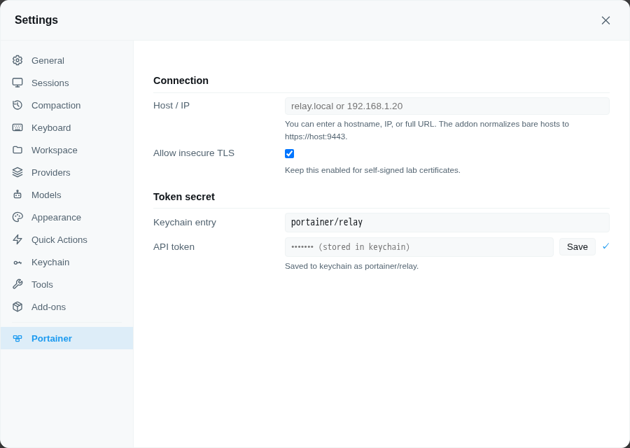

# @rcarmo/piclaw-addon-portainer

Portainer management tool — session-scoped API config, ad-hoc requests, and orchestration workflows for endpoints, stacks, containers, images, networks, and volumes

## Install

Open **Settings → Add-Ons** and install **portainer** from the catalog.

## Features

- Session-scoped `portainer` tool for API requests and higher-level workflows
- Add-on settings pane for default connection details (via the direct backend add-on config API)
- Host/IP stored in extension KV and normalized to a Portainer base URL
- API token secret stored in the piclaw keychain
- Agent skills for guided tool usage

## Settings pane

Open **Settings → Portainer** to configure the default Portainer host and API token.

- Tags: portainer, docker, containers, infrastructure
