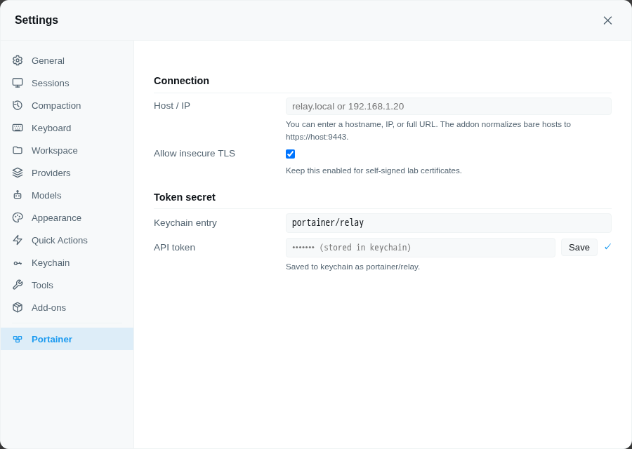

# Portainer

Portainer API management through one session-scoped `portainer` tool. Requires Piclaw `>=1.8.0`.

## Install and configure

Open **Settings → Add-Ons**, install **portainer**, then configure **Settings → Portainer**.

Non-secret defaults use `/agent/addons/api/portainer/config` and extension KV. Store the API token in the keychain; the default entry is `portainer/relay`. Hostnames and bare IP addresses are normalised to `https://<host>:9443`.

## Tool actions

- `get`, `set`, `clear` — session override management
- `discover` — find settings, environment, and keychain candidates
- `contract`, `capabilities`, `workflow_help`, `request_help`, `recommend` — inspect the tool contract before calling it
- `request` — one raw Portainer API request or a bounded sequential batch
- `workflow` — named endpoint, stack, container, image, network, or volume workflow

Use `portainer capabilities` for workflow families and `portainer workflow_help` for required fields. Raw requests support retries, throttling, per-request timeouts, and optional workspace JSON/JSONL output.

## Security and scope

- Secrets are resolved from keychain-backed environment/runtime access and are never returned in tool details.
- Self-signed TLS is allowed only when `allow_insecure_tls` is enabled.
- Mutating and destructive workflows require explicit fields; inspect workflow help before bulk upgrades, deletes, or prunes.

## Skill

The bundled `portainer-container-compare-chart` skill collects bounded container stats through the tool and renders SVG/CSV comparison artifacts.
