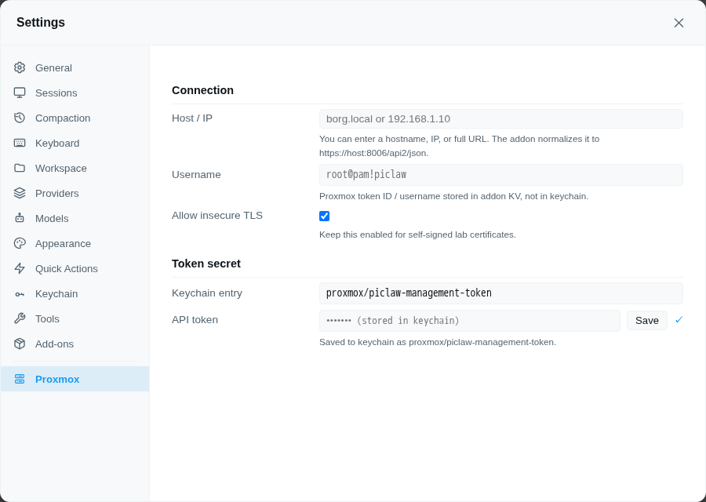

# @rcarmo/piclaw-addon-proxmox

Proxmox VE management tool — session-scoped API config, ad-hoc requests, and orchestration workflows for VMs, LXC containers, storage, tasks, and metrics

## Install

Open **Settings → Add-Ons** and install **proxmox** from the catalog.

## Features

- Session-scoped `proxmox` tool for API requests and higher-level workflows
- Add-on settings pane for default connection details (via the direct backend add-on config API)
- Username stored in extension KV
- API token secret stored in the piclaw keychain
- Host/IP field that normalizes to the Proxmox `/api2/json` base URL
- Agent skills for guided tool usage

## Settings pane

Open **Settings → Proxmox** to configure the default Proxmox host, username, and API token.

- Tags: proxmox, infrastructure, virtualization, homelab
