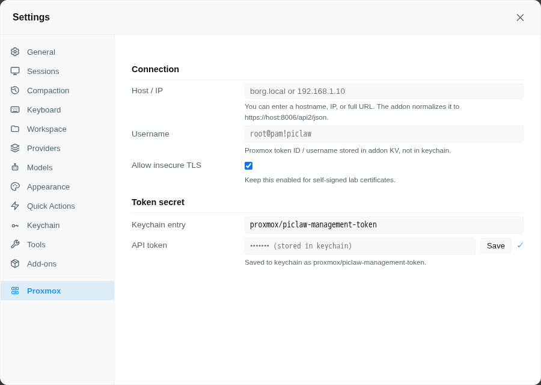

# Proxmox

Proxmox VE management through one session-scoped `proxmox` tool. Requires Piclaw `>=1.8.0`.

## Install and configure

Open **Settings → Add-Ons**, install **proxmox**, then configure **Settings → Proxmox**.

Non-secret defaults use `/agent/addons/api/proxmox/config` and extension KV. Store the API token secret in the keychain; the default entry is `proxmox/piclaw-management-token`. Configure the separate token username, such as `root@pam!piclaw`. Hostnames and bare IP addresses are normalised to `https://<host>:8006/api2/json`.

## Tool actions

- `get`, `set`, `clear` — session override management
- `discover` — find settings, environment, and keychain candidates
- `contract`, `capabilities`, `workflow_help`, `request_help`, `recommend` — inspect supported operations
- `request` — one raw Proxmox API request or a bounded sequential batch
- `workflow` — named cluster, VM, LXC, node, storage, backup, task, snapshot, guest-agent, or metrics workflow

Use `proxmox capabilities` and `proxmox workflow_help` before mutating infrastructure. Raw requests support retries, throttling, per-request timeouts, and optional workspace JSON/JSONL output.

## Security and scope

- Tokens are resolved from keychain-backed runtime access and are never returned in tool details.
- Self-signed TLS is allowed only when `allow_insecure_tls` is enabled.
- Destructive operations require explicit workflow fields and should be preceded by inspection/status calls.

## Skill

The bundled `proxmox-guest-compare-chart` skill collects bounded guest metrics through the tool and renders SVG/CSV comparison artifacts.
