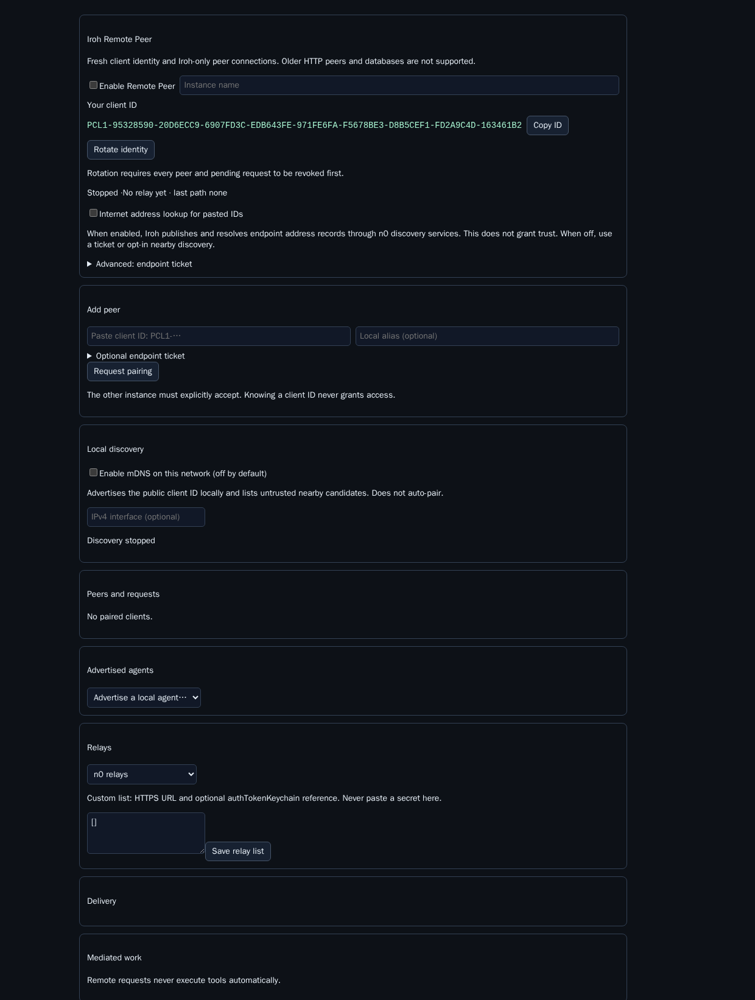
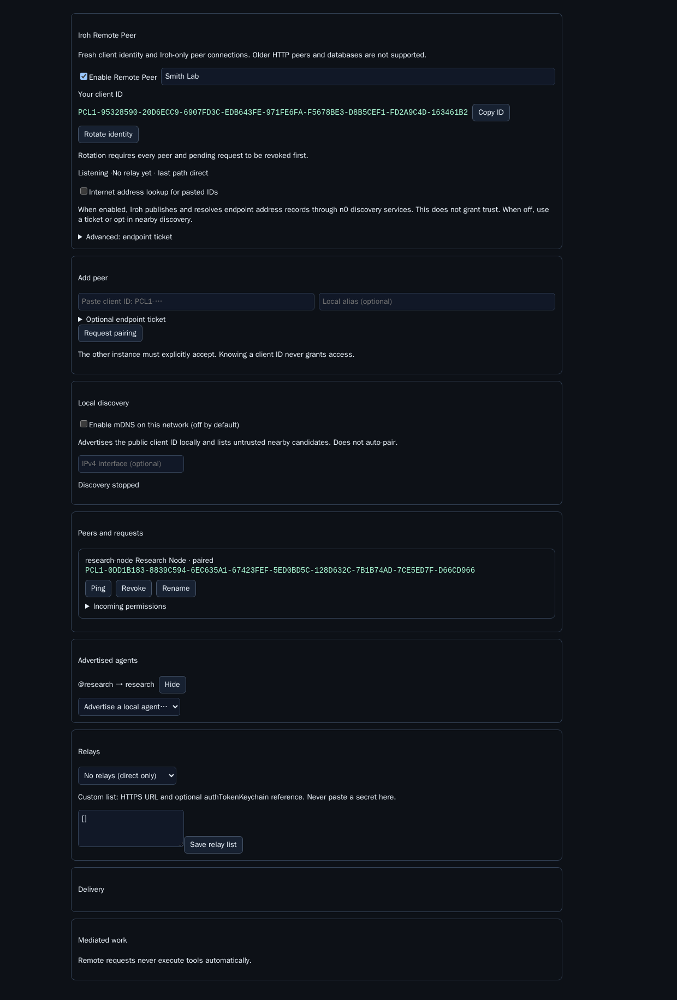

# Remote Peer — Iroh

Connect Piclaw instances by client ID using Iroh QUIC. All peer traffic uses Iroh, with direct connections and encrypted relay fallback. No public inbound HTTP endpoint is needed.

This is a clean break from Remote Peer 0.2: no old clients, HTTP peer routes, database migration or identity import. Existing installed files are left untouched. Both ends must install the new version and pair again.

## Pair in Settings





1. Enable Remote Peer on both instances and set their names.
2. Copy the **Your client ID** value (`PCL1-…`).
3. For internet ID-only pairing, explicitly enable **Internet address lookup** on both instances. This publishes/resolves endpoint addresses through Iroh's n0 services; it does not enumerate or trust peers.
4. Paste the other client ID under **Add peer**, choose a local alias, and request pairing.
5. On the recipient, compare the client ID with its owner and explicitly accept. Initial permissions are inbox-only, queue mode, files off.

Address lookup and mDNS are separate controls. Both default off. Without internet lookup, exchange an endpoint ticket using the advanced field, or opt into nearby discovery. A bare public key contains no routable address.

## Optional mDNS

**Enable mDNS on this network** is off by default. Disabled means no multicast socket, advertisement, browser query or discovery timer. Enabling advertises minimal public ID/version hints and displays nearby, untrusted candidates. Selecting a candidate fills the pairing ID; it never grants trust.

An optional IPv4 interface restricts advertisements. mDNS typically stays on one multicast segment; VLANs, VPNs, containers and access points may block it. Manual ticket pairing still works. The implementation uses `bonjour-service@1.4.4` on Bun's `node:dgram` compatibility; no system Bonjour/Avahi service is required.

## Chat and permissions

Agents use the normal `chat` tool:

```text
chat({ action: "directory" })
chat({ target_address: "lab!inbox", content: "Please review this", mode: "queue", idempotency_key: "review-1" })
```

Advertise a local agent and explicitly grant it before using `lab!@research`. Reply to supplied opaque `lab!reply.…` addresses without decoding them. Queue/auto/steer and file permissions remain receiver-controlled. Broader permissions require `ALLOW REMOTE ACCESS` confirmation.

Files are sent as raw bytes inside bounded Iroh frames: four files maximum, 16 MiB each, 32 MiB total. SHA-256 is checked at both ends. Outbound payloads are stored until acknowledged; retries reuse message IDs and return a stored receipt without duplicating normal completed delivery.

If the receiver crashes between calling Piclaw delivery and recording the receipt, its record remains `delivering`. Retries report an unknown outcome rather than risking duplicate tool-triggering messages. Inspect that record before taking further action; exactly-once delivery across that crash boundary is not claimed.

Work requests remain operator-mediated. Neither a pairing nor an `execute` request grants tool execution. Reviewed results may be returned from Settings or the management tool.

## Storage and dependencies

Fresh state lives under `<addon-data>/iroh-v1/`: `secret-key.bin` (32 bytes, mode 0600), `peers.db` and SQLite WAL files. The Iroh Ed25519 public key is the client identity, displayed with a checksum for copying. The secret is never returned by Settings or tools. Old `state.db` and `identity.json` are not read or changed.

Pinned dependencies: `@number0/iroh@1.1.0` (prebuilt N-API) and `bonjour-service@1.4.4`. No local Rust/native compiler is required. The published Iroh entrypoint layout is handled by loading its explicit root `index.js`. Unsupported native targets receive an error rather than a source-build attempt. Target runtime: Bun 1.4.1 and Piclaw 3.0.1 or newer with add-on lifecycle API v1 (core PRs #1285 and #1288).

Custom relays require HTTPS URLs. Authentication is an optional keychain entry name, never a secret pasted into configuration. Do not enable public address lookup if private address publication is unacceptable. Iroh relay networking may itself use HTTP/WebSocket internally; the removed HTTP transport is Remote Peer's application transport.

## Management API

`remote_peer` actions: `status`, `identity`, `ticket`, `pair`, `accept`, `deny`, `revoke`, `forget`, `alias`, `policy`, `advertise`, `unadvertise`, `ping`, `retry`, `work_send`, `work_review`.

Settings uses `/agent/addons/api/remote-peer/config` and `/dashboard`. The old `/pair` command and HTTP pairing protocol are removed. Removing a revoked record requires full-ID confirmation and only permits a new explicit pairing attempt.

## Validation status

See [test evidence](docs/e2e-matrix.md). Local Bun 1.4.1 tests cover real loopback QUIC pairing/messages/files/replies, persistence, permission gates, frame/signature rejection and discovery lifecycle. A same-host n0 probe passed bare-client-ID pairing with mDNS off. Smith and VM 900 passed real two-device multicast discovery, explicit approval and one message over a direct Iroh path. Separate Docker networks with peer-address UDP rejected passed one message over the selected EU n0 relay. These owned fixtures were removed after verification.
