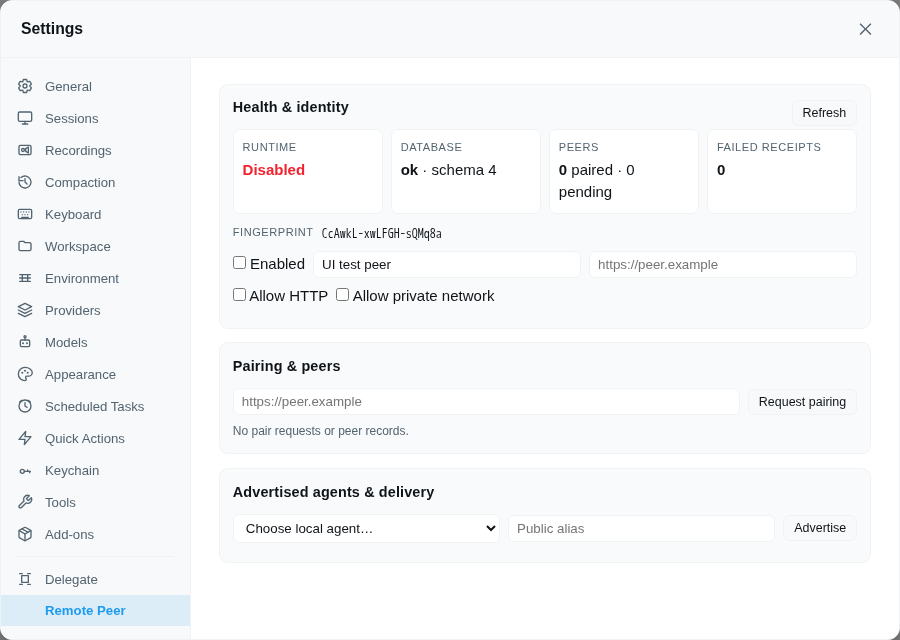

# Remote Peer

`@rcarmo/piclaw-addon-remote-peer` owns cross-instance Piclaw identity, state, pairing and messaging. It creates a fresh Ed25519 identity and dedicated SQLite database, establishes operator-approved peer trust through signed pairing, and delivers durable signed `peer!inbox` messages through Piclaw's existing `chat` tool.

## Requirements

- Piclaw `>=2.12.0`
- Messaging runtime API v1
- External routes API v1

The add-on does not import Piclaw runtime internals.

## Storage

The add-on uses Piclaw's scoped data directory:

```text
<PICLAW_DATA>/addons/remote-peer/
├── identity.json
├── state.db
├── state.db-wal
├── state.db-shm
└── backups/
```

`identity.json` is written with mode `0600` where supported. `state.db` uses WAL, foreign keys, secure delete, a five-second busy timeout, integrity checks and explicit checksummed migrations.

Peer, message, proposal, receipt and audit ledgers are relational tables in `state.db`. They are not stored in extension KV and are not added to Piclaw's `messages.db`.

Normal add-on uninstall preserves the scoped data directory. Destructive identity/database reset will be an explicit confirmed Settings action in a later release.

## Pairing and management

```text
remote_peer({ action: "status" })
remote_peer({ action: "identity" })
remote_peer({ action: "list_peers" })
remote_peer({ action: "pending" })
remote_peer({ action: "pair_request", url: "https://peer.example" })
remote_peer({ action: "accept_pair", request_id: "pair_..." })
remote_peer({ action: "deny_pair", request_id: "pair_..." })
remote_peer({ action: "ping", peer: "peer-alias" })
remote_peer({ action: "set_alias", peer: "peer-alias", alias: "new-alias" })
remote_peer({ action: "roster" })
remote_peer({ action: "roster", peer: "peer-alias" })
remote_peer({ action: "advertise_agent", local_agent: "research", alias: "research", modes: ["queue", "auto"] })
remote_peer({ action: "set_policy", peer: "peer-alias", scope: "named-agents", mode_ceiling: "queue-auto", agents: ["research"] })
remote_peer({ action: "message_status", message_id: "rmsg_..." })
remote_peer({ action: "message_failures" })
remote_peer({ action: "revoke", peer: "peer-alias" })
```

The `/pair` command provides equivalent pairing actions. Only public identity metadata is returned. The private key is never returned through tools, commands, external routes, or the Settings API.

## Send to a peer inbox

Use Piclaw's built-in `chat` tool with the paired peer's local alias, fingerprint, or instance ID:

```text
chat({ target_address: "lab!inbox", content: "Please review this finding.", mode: "queue" })
```

Use `peer!inbox` for the default inbox or `peer!@alias` for an operator-advertised agent. Replies use an opaque `peer!reply.<capability>` address embedded in the authenticated peer-message block; it routes back to the original source context without disclosing a raw chat JID.

The add-on persists outbound/inbound ledgers, signs the exact request body, verifies the authenticated peer, calls core's safe peer-delivery ABI, and returns a signed durable receipt. Supplying an `idempotency_key` makes safe retries return the original receipt without a second timeline row.

Pairing defaults to `inbox-only` and `queue`. Operators must explicitly advertise local aliases, grant each peer `named-agents` or `all-advertised` scope, and raise the mode ceiling before `auto` or `steer` can pass. Both the peer ceiling and advertised alias modes are enforced by the receiver.

Detailed documentation:

- [Protocol](docs/protocol.md)
- [Security model](docs/security.md)
- [Mediated work](docs/mediated-work.md)
- [Operator guide](docs/operator-guide.md)
- [Troubleshooting](docs/troubleshooting.md)
- [Architecture diagram](docs/architecture.svg)
- [0.1.0 two-instance E2E matrix](docs/e2e-matrix.md)

## Settings

The **Remote Peer** Settings pane provides:

- health, public identity, endpoint configuration, peer/pending/failure counts;
- immutable fingerprint/origin review for inbound pairing;
- peer aliases, messaging scopes, mode ceilings, revocation, and risk confirmations;
- operator-selected advertised local agents;
- pending requests, last-seen state, and failed-receipt status.

Fingerprint confirmation is required for acceptance and revocation. `all-advertised` and `steer` require the typed phrase `ALLOW REMOTE ACCESS`. Key rotation requires every peer be revoked first, then `ROTATE <current fingerprint>`; it archives the old identity and requires restart/re-pair. Runtime endpoint changes require a Piclaw restart. Browser payloads are redacted and never contain private keys, raw chat JIDs, reply capabilities, internal database paths, or unselected local agents.



## Mediated remote work

Use `work_send`, `work_status`, `work_wait`, `work_inbox`, `work_approve`, and `work_reject` through `remote_peer` for durable operator-reviewed requests. Both proposal and execute request shapes remain mediated; the add-on never grants direct remote tool execution. Signed one-time result callbacks route completed work back to the origin chat and persist failed delivery attempts for retry.

## Current scope

This release registers pairing, signed ping/revoke/message/roster/proposal/execute/result endpoints, the one-hop bang-address transport, and mediated work review. It does not grant a remote peer direct Piclaw tool execution.
