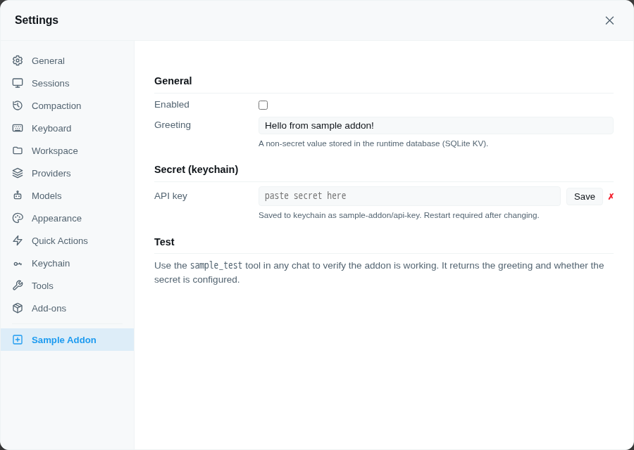

# Sample Add-on

Starter template for piclaw add-on developers. Demonstrates the core patterns every settings-aware add-on needs.

## Install

Open **Settings → Add-Ons** and install **sample-addon** from the catalog.

## What it demonstrates

### 1. Settings pane

Registers a **Settings → Sample Addon** pane with:

- browser-side UI in `web/index.ts`
- direct config reads/writes via `GET` / `POST /agent/addons/api/sample-addon/config`
- no dependency on internal slash commands

The browser pane is just a local authenticated client of piclaw itself:

```javascript
await fetch("/agent/addons/api/sample-addon/config");
await fetch("/agent/addons/api/sample-addon/config", {
  method: "POST",
  headers: { "Content-Type": "application/json" },
  body: JSON.stringify({ enabled: true, greeting: "Hello" }),
});
```

- **Checkbox** — enable/disable toggle
- **Text field** — a non-secret config value (greeting), auto-saved on blur
- **Password field** — a secret (API key), saved directly to the keychain with a Save button
- **Key presence indicator** — ✓/✗ showing whether the keychain entry exists



### 2. Direct backend config API

The runtime entry registers config handlers directly with piclaw:

```typescript
const registerAddonConfigApi = globalThis.__piclaw_registerAddonConfigApi;

registerAddonConfigApi?.("sample-addon", "config", {
  get: async () => loadConfig(),
  set: async (payload) => handleSetConfig(payload),
}, import.meta.dir);
```

Piclaw lazily loads installed add-on runtime entries on first config request, so the settings pane works without a slash-command bridge.

### 3. Config in the runtime database

All non-secret config is stored in the **extension KV store** (SQLite, global scope):

```typescript
import { createExtensionStorage } from "./compat/extension-kv.js";

const kv = createExtensionStorage("sample-addon");
kv.set("config", { enabled: true, greeting: "Hello" }, "global");
const cfg = kv.get("config", "global");
```

The compat shim (`compat/extension-kv.ts`) resolves the runtime's KV store automatically. Copy it from this addon when creating a new one.

### 4. Secrets in the keychain

The settings pane saves secrets via `POST /agent/keychain`:

```javascript
await fetch("/agent/keychain", {
  method: "POST",
  headers: { "Content-Type": "application/json" },
  body: JSON.stringify({ name: "sample-addon/api-key", secret: "sk-...", type: "token" }),
});
```

The runtime auto-injects keychain entries as environment variables — `sample-addon/api-key` becomes `$SAMPLE_ADDON_API_KEY` in `process.env` after restart.

### 5. Test tool

The `sample_test` tool returns the configured greeting and whether the secret is present, so you can verify the addon is wired correctly:

```
> use sample_test
Greeting: Hello from sample addon!
Secret configured: yes
```

## Storage model

| What | Where |
|---|---|
| API key / secret | **Keychain** — entry `sample-addon/api-key` (entered in settings pane) |
| Enabled, greeting, other config | **Runtime database** — extension KV store (SQLite, global scope, extension ID `sample-addon`) |

No config files are written to disk.

## File structure

```
addons/sample-addon/
├── package.json          # Addon manifest
├── index.ts              # Extension entry: direct config API, KV config, keychain secret, test tool
├── web/index.ts          # Settings pane: checkbox, text, password, keychain save
├── compat/extension-kv.ts # KV store compat shim (copy to your addon)
└── README.md             # This file
```

## Using as a template

1. Copy this directory to `addons/your-addon/`
2. Rename `sample-addon` → `your-addon` in `package.json`, `index.ts`, and `web/index.ts`
3. Replace the greeting field with your config
4. Replace the secret keychain entry name
5. Replace the test tool with your tool
6. If your add-on exposes a settings pane or other meaningful web UI, capture a screenshot on the microVM test instance and store it under `addons/your-addon/assets/`, then reference it from the README. For settings panes, prefer an overlayfs-based clean fixture, show only the target pane during the screenshot, and restore `cheapskate` afterward.
7. Run `bun run scripts/sync-catalog.ts --write` to update the catalog
