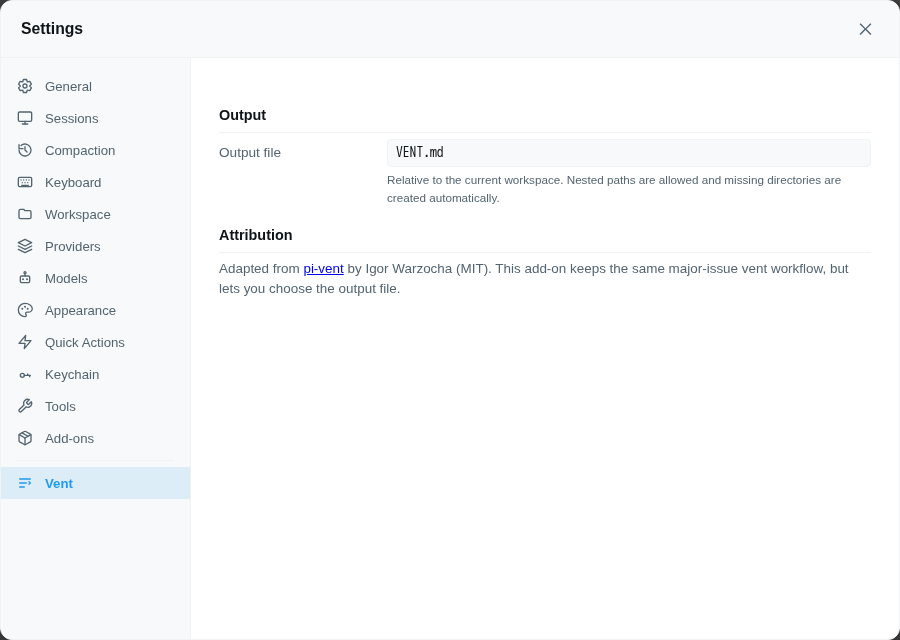

# @rcarmo/piclaw-addon-vent

Workspace vent-log add-on for piclaw.

This is an **adapted repackaging** of [pi-vent](https://github.com/IgorWarzocha/pi-vent) by **Igor Warzocha**, released under the **MIT** license. The main addition is a **Settings** pane that lets you choose the output file instead of always writing to `VENT.md`.

## Attribution

| Field | Value |
|---|---|
| Original project | [`@howaboua/pi-vent`](https://github.com/IgorWarzocha/pi-vent) |
| Original author | Igor Warzocha |
| Original license | MIT |
| Upstream source snapshot | `vendor/pi-vent/` |
| Adaptation in this add-on | Configurable output file via Settings → Vent |

The upstream MIT license text is included at:
- `addons/vent/vendor/pi-vent/LICENSE`

## Install

Open **Settings → Add-Ons** and install **vent** from the catalog.

## What it does

Registers a `vent` tool that appends major-issue feedback to a markdown log in the current workspace.

Use it for things worth remembering:
- repeated tool failures
- misleading docs
- confusing instructions
- flaky commands
- avoidable friction that materially slowed the task down

Not for minor annoyances.

## Settings

Open **Settings → Vent** to choose the output file.



Default:
- `VENT.md`

Rules:
- path is **relative to the current workspace**
- nested paths are allowed, e.g. `notes/vent/VENT.md`
- missing parent directories are created automatically
- absolute paths and `..` path escapes are rejected

## Tool

```ts
vent({
  thought: string,
  trigger?: string
})
```

- `thought` — candid feedback, frustration, confusion, or a short postmortem note
- `trigger` — optional short label, e.g. `tool_error`, `bad_docs`, `confusing_task`

## Storage model

| What | Where |
|---|---|
| Output file path | **Runtime database** — extension KV store (SQLite, global scope, extension ID `vent`) |
| Vent log entries | **Workspace file** — configurable relative path, default `VENT.md` |

## Example output

```md
## 26-04-30 06:20 — bad_docs

The docs were stale and pointed at a path that no longer exists.
```

## Files

```
addons/vent/
├── package.json
├── index.ts
├── index.test.ts
├── web/index.ts
├── compat/extension-kv.ts
├── skills/vent/SKILL.md
├── vendor/pi-vent/LICENSE
├── vendor/pi-vent/README.md
└── README.md
```
