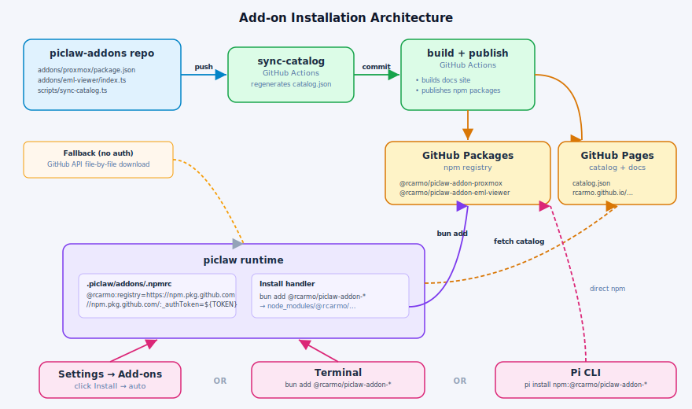

# Architecture

## Catalog

`catalog.json` is the central index consumed by the piclaw web UI. It is auto-generated from each addon's `package.json` by the `sync-catalog` workflow and should never be hand-edited (except for the `owner` and `contributors` fields).

Each entry:

```json
{
  "slug": "proxmox",
  "name": "@rcarmo/piclaw-addon-proxmox",
  "version": "0.1.3",
  "install": {
    "kind": "npm",
    "spec": "@rcarmo/piclaw-addon-proxmox@0.1.3",
    "registry": "https://npm.pkg.github.com",
    "piSource": "npm:@rcarmo/piclaw-addon-proxmox@0.1.3"
  },
  "owner": { "login": "rcarmo", "url": "https://github.com/rcarmo" },
  "contributors": [],
  "updatedAt": "2026-04-27"
}
```

| Field | Purpose |
|---|---|
| `install.spec` | Passed to `bun add` — scoped package name + version |
| `install.registry` | GitHub Packages npm registry URL |
| `install.piSource` | Spec string for `pi install` |
| `owner` | Primary maintainer — hand-managed, preserved by sync |
| `contributors` | Additional contributors — hand-managed |
| `updatedAt` | Date of last git commit to the addon directory (auto) |

## Installation flow



1. The piclaw web UI fetches `catalog.json` from GitHub Pages.
2. The user picks an addon and clicks Install.
3. The runtime calls `bun add --force <install.spec>` in `.piclaw/addons/`.
4. piclaw configures `.npmrc` with the GitHub Packages registry and an auth token from the keychain (`GITHUB_PICLAW_BOT_PAT` or `GITHUB_TOKEN`). Any token with `read:packages` scope is sufficient.
5. If `bun add` fails (no token, network issue), the runtime falls back to downloading individual files from the addon's GitHub repository path. Slower, but requires no registry auth.

## Repo layout

```
piclaw-addons/
├── addons/               # One directory per addon (independent npm packages)
├── assets/               # Diagrams and static site assets
├── lib/compat/           # Shared compatibility shims (not published separately)
├── scripts/
│   ├── browser-relay/    # WSL2 browser relay helper (see its README)
│   └── sync-catalog.ts   # Catalog + root package metadata generator
├── build.ts              # Static docs site builder
├── catalog.json          # Auto-generated addon index
├── package.json          # Root package manifest (@rcarmo/piclaw-addons)
└── .github/workflows/
    ├── build.yml              # Docs + GitHub Pages deploy
    ├── sync-catalog.yml       # Catalog auto-regeneration on addon change
    ├── validate-metadata.yml  # Metadata validation on PRs and pushes
    ├── publish.yml            # GitHub Packages publish on catalog change
    └── triage-issues.yml      # Auto-label issues by addon and notify owner
```

## CI/CD

| Workflow | Trigger | What it does |
|---|---|---|
| `validate-metadata` | every push + PRs | Runs `check:catalog` and `bun pm pack --dry-run` |
| `sync-catalog` | `addons/**` push | Regenerates `catalog.json`, commits if changed |
| `build` | `catalog.json` / `build.ts` / `assets/**` / `addons/**` | Builds docs site + packs tarballs → deploys to gh-pages |
| `publish` | `catalog.json` / `addons/**/package.json` | Publishes each addon to GitHub Packages (skips already-published versions) |
| `triage-issues` | issue opened | Scores issue text against addon slugs/tags, posts comment + applies `addon:<slug>` label |

## Metadata commands

```bash
bun run check:catalog   # Validate catalog.json is in sync with addon package.json files
bun run sync:catalog    # Regenerate catalog.json + root package.json metadata
```
